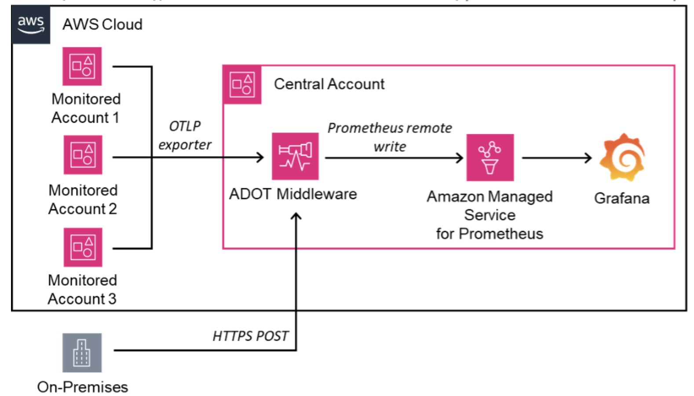

# AWS オープンソースサービスを使用したクロスアカウントモニタリング

## はじめに

現代のクラウド環境は、複数のアカウントにまたがり、オンプレミスのインフラストラクチャを含むことが多く、複雑なモニタリングの課題が生じます。これらの課題に対処するため、AWS サービスと業界標準のツールを使用して、洗練されたモニタリングアーキテクチャを実装できます。このアーキテクチャにより、さまざまな環境全体に包括的な可視性が得られ、効率的な管理と迅速な問題解決が可能になります。

## 主要コンポーネント

このモニタリングソリューションの中心には、AWS Distro for OpenTelemetry (ADOT) があります。ADOT は、さまざまなソースからのメトリクスを集約する中央の収集ポイントとして機能します。ADOT は専用の中央 AWS アカウントにデプロイされ、モニタリングインフラストラクチャのハブを形成しています。この中央デプロイにより、データの集約と処理が合理化されます。

Amazon Managed Service for Prometheus は、収集したメトリクスを格納するための、スケーラブルで管理されたタイムシリーズデータベースです。このサービスにより、自己管理の Prometheus インスタンスが不要になり、運用オーバーヘッドが削減され、メトリクスデータの高可用性が確保されます。

可視化と分析のために、Grafana がアーキテクチャに統合されています。Grafana は Amazon Managed Service for Prometheus に接続され、強力なクエリ機能とカスタマイズ可能なダッシュボードを提供します。これにより、チームは収集したメトリクスに基づいて洞察に富む可視化を作成し、アラートを設定できます。

*図1: AWS オープンソースサービスを使用したマルチアカウントモニタリング*

## データ収集とフロー

この アーキテクチャは、監視対象アカウントと呼ばれる複数の AWS アカウントからのデータ収集をサポートしています。これらのアカウントは OpenTelemetry プロトコル (OTLP) を使用して、メトリクスを中央の ADOT インスタンスにエクスポートします。この標準化されたアプローチにより、データ形式の一貫性が確保され、新しいアカウントを監視設定に簡単に統合できます。

オンプレミスのインフラストラクチャもこの監視ソリューションに組み込まれています。これらのシステムは、セキュアな HTTPS POST リクエストを使用して、メトリクスデータを中央の ADOT インスタンスに送信します。この方法により、レガシーまたはクラウド外のシステムを全体的な監視戦略に含めることができ、真に包括的な IT 環境の視点を提供します。

データが中央の ADOT インスタンスに到達すると、処理された後、Prometheus リモートライトプロトコルを使用して Amazon Managed Service for Prometheus に転送されます。このステップにより、収集されたすべてのメトリクスが時系列データに最適化された形式で保存され、効率的なクエリと分析が可能になります。

## 利点と考慮事項

この アーキテクチャには、いくつかの重要な利点があります。さまざまなソースからのメトリクスを一元的に把握できるため、複雑な環境を包括的に監視できます。マネージドサービスを利用することで、チームの運用負荷が軽減され、インフラストラクチャの保守ではなく分析に集中できます。さらに、このアーキテクチャは高い拡張性があり、監視対象のシステム数やメトリクス収集量の増加に対応できます。

しかし、このアーキテクチャの実装には考慮すべき点もあります。ソリューションが中央集権型であるため、中央アカウントの監視インフラストラクチャが重要になり、高可用性と災害復旧のための慎重な計画が必要です。また、アカウント間のデータ転送やマネージドサービスの利用に関連してコストが発生する可能性があり、予算の決定に考慮する必要があります。

セキュリティも重要な検討事項です。セキュアなクロスアカウントメトリクス収集を可能にするため、適切な IAM ロールとアクセス許可を設定する必要があります。オンプレミスシステムの場合、監視データの完全性と機密性を維持するため、安全で認証された HTTPS 接続を確保することが不可欠です。

## 結論

この高度な AWS クラウドモニタリングアーキテクチャは、複雑なマルチアカウント、ハイブリッドインフラストラクチャ環境を持つ組織に堅牢なソリューションを提供します。AWS 管理サービスと OpenTelemetry、Grafana などの業界標準ツールを活用することで、スケーラブルで強力なモニタリングソリューションを実現します。効果的に実装するには慎重な計画と管理が必要ですが、包括的な可視性と集中モニタリングのメリットは、モダンなクラウドネイティブおよびハイブリッド環境にとって非常に価値があります。

このアーキテクチャの柔軟性により、さまざまな組織のニーズに適応でき、モニタリング要件が変化しても進化できます。クラウド環境の複雑さが高まり続けるため、このような集中型の包括的なモニタリングソリューションを持つことが、オペレーショナルエクセレンスを維持し、すべてのインフラストラクチャコンポーネントで最適なパフォーマンスを確保するために不可欠になります。
