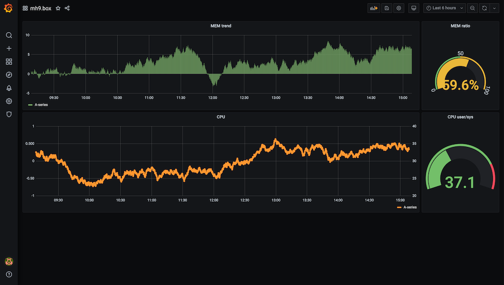

# ディメンション

このサイトのコンテキストでは、オブザーバビリティの領域を 6 つのディメンションで考えます。
各ディメンションを独立して見ることは、総合的な観点から有益です。
つまり、特定のワークロードに対して具体的なオブザーバビリティソリューションを構築しようとする際に役立ちます。
これには、使用するプログラミング言語などの開発者関連の側面や、コンテナや Lambda 関数などのランタイム環境といった運用上のトピックが含まれます。

:::note
    「シグナルとは何か？」
    ここでシグナルと言う場合、ログエントリ、メトリクス、トレースを含む、あらゆる種類のオブザーバビリティデータとメタデータポイントを指します。
    特に指定する必要がない限り、「シグナル」という用語を使用し、コンテキストから適用される制限が明確になるはずです。
:::

それでは、6 つのディメンションを一つずつ見ていきましょう：

## 出力先

この次元では、長期保存やシグナルを利用するためのグラフィカルインターフェースなど、あらゆる種類のシグナルの出力先を考慮します。開発者として、サービスのトラブルシューティングを行うために、シグナルを発見、検索、相関させることができる UI や API へのアクセスが必要です。インフラストラクチャやプラットフォームの役割では、インフラストラクチャの状態を理解するために、シグナルを管理、発見、検索、相関させることができる UI や API へのアクセスが必要です。

究極的に、これは人間の観点から最も興味深い次元です。しかし、その恩恵を受けるためには、まず少し作業が必要です。ソフトウェアと外部依存関係に計装を施し、シグナルを出力先に取り込む必要があります。

では、シグナルはどのようにして出力先に到達するのでしょうか？ お尋ねいただいてありがとうございます。それは…

## エージェント

シグナルがどのように収集され、分析にルーティングされるかについて説明します。
シグナルは 2 つのソースから得られます。
1 つはアプリケーションのソースコード (言語のセクションも参照)、もう 1 つはアプリケーションが依存するもの、つまりデータストアで管理される状態や VPC などのインフラストラクチャ (インフラとデータのセクションも参照) です。

エージェントは、シグナルの収集と取り込みに使用するテレメトリの一部です。
テレメトリのもう一部は、計装されたアプリケーションやデータベースなどのインフラ要素です。

## プログラミング言語

この次元は、サービスやアプリケーションを作成するために使用するプログラミング言語に関するものです。
ここでは、[X-Ray SDK][xraysdks] や OpenTelemetry が [計装][otelinst] の文脈で提供するような SDK やライブラリを扱います。
ログやメトリクスなどの特定のシグナルタイプに対して、選択したプログラミング言語をオブザーバビリティソリューションがサポートしていることを確認する必要があります。

## インフラストラクチャとデータベース

この次元では、サービスが実行されている VPC のようなインフラストラクチャや、RDS や DynamoDB のようなデータストア、SQS のようなキューなど、アプリケーション外部の依存関係を意味します。

:::tip
    「共通点」
    この次元のすべてのソースに共通しているのは、アプリケーション（およびアプリが実行されるコンピューティング環境）の外部に位置しており、不透明なボックスとして扱う必要があるということです。
:::

この次元には以下が含まれますが、これらに限定されません：

- AWS インフラストラクチャ、例えば [VPC フローログ][vpcfl]。
- [Kubernetes コントロールプレーンログ][kubecpl] のような二次的な API。
- [S3][s3mon]、[RDS][rdsmon]、[SQS][sqstrace] などのデータストアからのシグナル。

## コンピュートユニット

コードをパッケージ化し、スケジュールし、実行する方法です。例えば、Lambda では関数であり、[ECS][ecs] と [EKS][eks] では、それぞれタスク (ECS) または Pod (EKS) で実行されるコンテナがそのユニットとなります。
Kubernetes のようなコンテナ化された環境では、テレメトリーのデプロイメントに関して、通常 2 つのオプションがあります：サイドカーとして、または各ノード (インスタンス) 上のデーモンプロセスとしてです。

## コンピュートエンジン

このディメンションは、基本的なランタイム環境を指します。これは、(例えば EC2 インスタンスの場合のように) プロビジョニングとパッチ適用が必要な場合もあれば、(Fargate や Lambda などのサーバーレスオファリングの場合のように) 必要ない場合もあります。使用するコンピュートエンジンによっては、テレメトリー部分がすでにオファリングの一部となっている場合があります。例えば、[Fargate 上の EKS][firelensef] には Fluent Bit を介したログルーティングが統合されています。

[aes]: https://aws.amazon.com/jp/elasticsearch-service/ "Amazon Elasticsearch Service"
[adot]: https://aws-otel.github.io/ "AWS Distro for OpenTelemetry"
[amg]: https://aws.amazon.com/jp/grafana/ "Amazon Managed Grafana"
[amp]: https://aws.amazon.com/jp/prometheus/ "Amazon Managed Service for Prometheus"
[batch]: https://aws.amazon.com/jp/batch/ "AWS Batch"
[beans]: https://aws.amazon.com/jp/elasticbeanstalk/ "AWS Elastic Beanstalk"
[cw]: https://aws.amazon.com/jp/cloudwatch/ "Amazon CloudWatch"
[dimensions]: ../dimensions
[ec2]: https://aws.amazon.com/jp/ec2/ "Amazon EC2"
[ecs]: https://aws.amazon.com/jp/ecs/ "Amazon Elastic Container Service"
[eks]: https://aws.amazon.com/jp/eks/ "Amazon Elastic Kubernetes Service"
[fargate]: https://aws.amazon.com/jp/fargate/ "AWS Fargate"
[fluentbit]: https://fluentbit.io/ "Fluent Bit"
[firelensef]: https://aws.amazon.com/blogs/containers/fluent-bit-for-amazon-eks-on-aws-fargate-is-here/ "Fluent Bit for Amazon EKS on AWS Fargate is here"
[jaeger]: https://www.jaegertracing.io/ "Jaeger"
[kafka]: https://kafka.apache.org/ "Apache Kafka"
[kubecpl]: https://docs.aws.amazon.com/ja_jp/eks/latest/userguide/control-plane-logs.html "Amazon EKS control plane logging"
[lambda]: https://aws.amazon.com/jp/lambda/ "AWS Lambda"
[lightsail]: https://aws.amazon.com/jp/lightsail/ "Amazon Lightsail"
[otel]: https://opentelemetry.io/ "OpenTelemetry"
[otelinst]: https://opentelemetry.io/docs/concepts/instrumenting/
[promex]: https://prometheus.io/docs/instrumenting/exporters/ "Prometheus exporters and integrations"
[rdsmon]: https://docs.aws.amazon.com/ja_jp/AmazonRDS/latest/UserGuide/Overview.LoggingAndMonitoring.html "Logging and monitoring in Amazon RDS"
[s3]: https://aws.amazon.com/jp/s3/ "Amazon S3"
[s3mon]: https://docs.aws.amazon.com/ja_jp/AmazonS3/latest/userguide/s3-incident-response.html "Logging and monitoring in Amazon S3"
[sqstrace]: https://docs.aws.amazon.com/ja_jp/xray/latest/devguide/xray-services-sqs.html "Amazon SQS and AWS X-Ray"
[vpcfl]: https://docs.aws.amazon.com/ja_jp/vpc/latest/userguide/flow-logs.html "VPC Flow Logs"
[xray]: https://aws.amazon.com/jp/xray/ "AWS X-Ray"
[xraysdks]: https://docs.aws.amazon.com/ja_jp/xray/index.html
