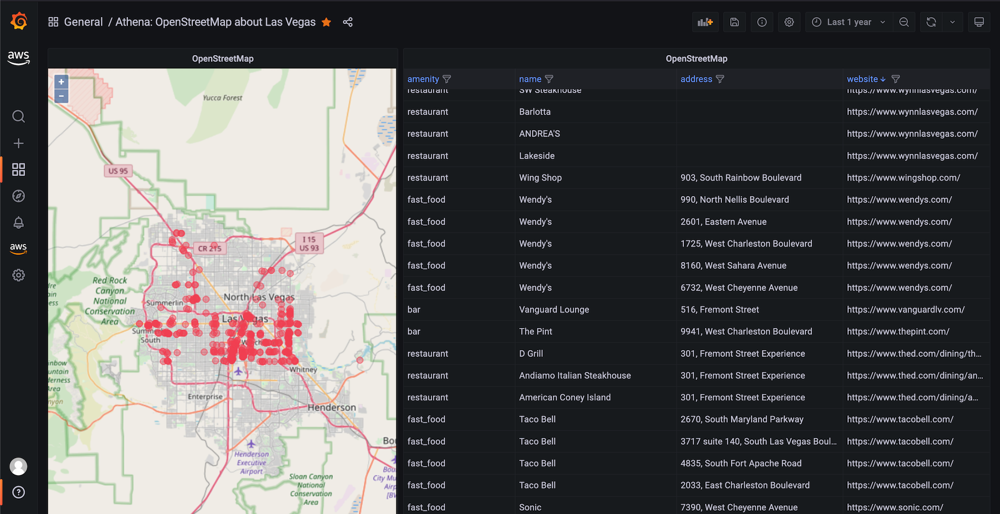

# Amazon Managed Grafana での Athena の使用

このレシピでは、[Amazon Athena][athena]（標準 SQL を使用して Amazon S3 のデータを分析できるサーバーレスの対話型クエリサービス）を [Amazon Managed Grafana][amg] で使用する方法を紹介します。この統合は、[Grafana 用 Athena データソース][athena-ds]（オープンソースのプラグイン）によって実現されており、任意の DIY Grafana インスタンスで使用できるだけでなく、Amazon Managed Grafana にもプリインストールされています。

:::note
    このガイドは約 20 分で完了します。
:::


## 前提条件

* [AWS CLI][aws-cli] が環境にインストールされ、[設定][aws-cli-conf] されていること。
* アカウントから Amazon Athena にアクセスできること。


## インフラストラクチャ

まず、必要なインフラストラクチャをセットアップしましょう。


### Amazon Athena のセットアップ

Athena を 2 つの異なるシナリオで使用する方法を見ていきます。1 つは地理データと Geomap プラグインに関するシナリオで、もう 1 つは VPC フローログに関するセキュリティ関連のシナリオです。

まず、Athena がセットアップされ、データセットがロードされていることを確認しましょう。

:::warning
    これらのクエリを実行するには、Amazon Athena コンソールを使用する必要があります。Grafana は一般的にデータソースへの読み取り専用アクセスを持つため、データの作成や更新には使用できません。
:::


#### 地理データの読み込み

この最初のユースケースでは、[AWS オープンデータレジストリ][awsod] からのデータセットを使用します。
具体的には、地理データに関連するユースケースにおける Athena プラグインの使用方法を示すために、[OpenStreetMap][osm] (OSM) を使用します。
そのためには、まず OSM データを Athena に取り込む必要があります。

まず、Athena で新しいデータベースを作成します。[Athena コンソール][athena-console] に移動し、以下の 3 つの SQL クエリを使用して OSM データをデータベースにインポートします。

クエリ 1：

```sql
CREATE EXTERNAL TABLE planet (
  id BIGINT,
  type STRING,
  tags MAP<STRING,STRING>,
  lat DECIMAL(9,7),
  lon DECIMAL(10,7),
  nds ARRAY<STRUCT<ref: BIGINT>>,
  members ARRAY<STRUCT<type: STRING, ref: BIGINT, role: STRING>>,
  changeset BIGINT,
  timestamp TIMESTAMP,
  uid BIGINT,
  user STRING,
  version BIGINT
)
STORED AS ORCFILE
LOCATION 's3://osm-pds/planet/';
```

クエリ 2：

```sql
CREATE EXTERNAL TABLE planet_history (
    id BIGINT,
    type STRING,
    tags MAP<STRING,STRING>,
    lat DECIMAL(9,7),
    lon DECIMAL(10,7),
    nds ARRAY<STRUCT<ref: BIGINT>>,
    members ARRAY<STRUCT<type: STRING, ref: BIGINT, role: STRING>>,
    changeset BIGINT,
    timestamp TIMESTAMP,
    uid BIGINT,
    user STRING,
    version BIGINT,
    visible BOOLEAN
)
STORED AS ORCFILE
LOCATION 's3://osm-pds/planet-history/';
```

クエリ 3：

```sql
CREATE EXTERNAL TABLE changesets (
    id BIGINT,
    tags MAP<STRING,STRING>,
    created_at TIMESTAMP,
    open BOOLEAN,
    closed_at TIMESTAMP,
    comments_count BIGINT,
    min_lat DECIMAL(9,7),
    max_lat DECIMAL(9,7),
    min_lon DECIMAL(10,7),
    max_lon DECIMAL(10,7),
    num_changes BIGINT,
    uid BIGINT,
    user STRING
)
STORED AS ORCFILE
LOCATION 's3://osm-pds/changesets/';
```


#### VPC フローログデータの読み込み

2 つ目のユースケースはセキュリティに関連するものです。[VPC フローログ][vpcflowlogs] を使用してネットワークトラフィックを分析します。

まず、EC2 に VPC フローログを生成するよう指示する必要があります。まだ行っていない場合は、[VPC フローログを作成][createvpcfl] してください。ネットワークインターフェースレベル、サブネットレベル、または VPC レベルのいずれかで作成できます。

:::note
    クエリのパフォーマンスを向上させ、ストレージの使用量を最小限に抑えるため、VPC フローログはネストされたデータをサポートする列指向ストレージ形式である [Parquet][parquet] で保存します。
:::

今回のセットアップでは、以下に示すように Parquet 形式で S3 バケットに公開する限り、どのオプション（ネットワークインターフェース、サブネット、または VPC）を選択しても問題ありません。


次に、[Athena コンソール][athena-console] を使用して、OSM データをインポートしたのと同じデータベース内に VPC フローログデータのテーブルを作成します。または、必要に応じて新しいデータベースを作成してもかまいません。

以下の SQL クエリを使用し、`VPC_FLOW_LOGS_LOCATION_IN_S3` を自分のバケット/フォルダに置き換えてください。

```sql
CREATE EXTERNAL TABLE vpclogs (
  `version` int, 
  `account_id` string, 
  `interface_id` string, 
  `srcaddr` string, 
  `dstaddr` string, 
  `srcport` int, 
  `dstport` int, 
  `protocol` bigint, 
  `packets` bigint, 
  `bytes` bigint, 
  `start` bigint, 
  `end` bigint, 
  `action` string, 
  `log_status` string, 
  `vpc_id` string, 
  `subnet_id` string, 
  `instance_id` string, 
  `tcp_flags` int, 
  `type` string, 
  `pkt_srcaddr` string, 
  `pkt_dstaddr` string, 
  `region` string, 
  `az_id` string, 
  `sublocation_type` string, 
  `sublocation_id` string, 
  `pkt_src_aws_service` string, 
  `pkt_dst_aws_service` string, 
  `flow_direction` string, 
  `traffic_path` int
)
STORED AS PARQUET
LOCATION 'VPC_FLOW_LOGS_LOCATION_IN_S3'
```

例えば、S3 バケット `allmyflowlogs` を使用している場合、`VPC_FLOW_LOGS_LOCATION_IN_S3` は以下のようになります。

```
s3://allmyflowlogs/AWSLogs/12345678901/vpcflowlogs/eu-west-1/2021/
```

これでデータセットが Athena で利用可能になりました。次は Grafana に進みましょう。


### Grafana のセットアップ

Grafana インスタンスが必要なので、新しい [Amazon Managed Grafana ワークスペース][amg-workspace] をセットアップしてください。例えば、[Getting Started][amg-getting-started] ガイドを使用するか、既存のものを使用してください。

:::warning
    AWS データソース設定を使用するには、まず Amazon Managed Grafana コンソールに移動して、サービス管理の IAM ロールを有効にし、ワークスペースに Athena リソースを読み取るために必要な IAM ポリシーを付与します。
    さらに、以下の点に注意してください：

	1. 使用予定の Athena ワークグループには、キー `GrafanaDataSource` と値 `true` のタグを付ける必要があります。これにより、サービス管理の権限がワークグループを使用することが許可されます。
	1. サービス管理の IAM ポリシーは、`grafana-athena-query-results-` で始まるクエリ結果バケットへのアクセスのみを許可します。それ以外のバケットについては、手動で権限を追加する必要があります。
	1. クエリ対象の基礎となるデータソースに対して、`s3:Get*` と `s3:List*` の権限を手動で追加する必要があります。
:::

Athena データソースをセットアップするには、左側のツールバーを使用して、下部の AWS アイコンを選択し、次に「Athena」を選択します。プラグインが Athena データソースを検出するためのデフォルトリージョンを選択し、使用するアカウントを選択して、最後に「Add data source」を選択します。

または、以下の手順に従って Athena データソースを手動で追加および設定することもできます：

1. 左側のツールバーの「Configurations」アイコンをクリックし、次に「Add data source」をクリックします。
1. 「Athena」を検索します。
1. [オプション] 認証プロバイダーを設定します（推奨：ワークスペース IAM ロール）。
1. 対象の Athena データソース、データベース、ワークグループを選択します。
1. ワークグループに出力場所がまだ設定されていない場合は、クエリ結果に使用する S3 バケットとフォルダを指定します。サービス管理ポリシーの恩恵を受けたい場合、バケット名は `grafana-athena-query-results-` で始まる必要があることに注意してください。
1. 「Save & test」をクリックします。

以下のような画面が表示されるはずです：


## 使用方法

次に、Grafana から Athena データセットを使用する方法を見ていきましょう。


### 地理データの使用

Athena の [OpenStreetMap][osm] (OSM) データは、「特定の施設がどこにあるか」といった様々な質問に答えることができます。
実際に見てみましょう。

例えば、ラスベガス地域で食事を提供する場所をリストアップするための OSM データセットに対する SQL クエリは次のとおりです：

```sql
SELECT 
tags['amenity'] AS amenity,
tags['name'] AS name,
tags['website'] AS website,
lat, lon
FROM planet
WHERE type = 'node'
  AND tags['amenity'] IN ('bar', 'pub', 'fast_food', 'restaurant')
  AND lon BETWEEN -115.5 AND -114.5
  AND lat BETWEEN 36.1 AND 36.3
LIMIT 500;
```

:::info
    上記のクエリでラスベガス地域は、緯度が `36.1` から `36.3` の間、経度が `-115.5` から `-114.5` の間にあるすべての場所として定義されています。
    これらの値を変数のセット（各角に対して 1 つずつ）に変換し、Geomap プラグインを他の地域にも適応できるようにすることができます。
:::

上記のクエリを使用して OSM データを可視化するには、[osm-sample-dashboard.json](./amg-athena-plugin/osm-sample-dashboard.json) で利用可能なサンプルダッシュボードをインポートできます。
そのダッシュボードは次のように表示されます：



:::note
    上記のスクリーンショットでは、データポイントをプロットするために Geomap 可視化（左パネル）を使用しています。
:::


### VPC フローログデータの使用

VPC フローログデータを分析し、SSH および RDP トラフィックを検出するには、以下の SQL クエリを使用します。

SSH/RDP トラフィックの表形式の概要を取得する：

```sql
SELECT
srcaddr, dstaddr, account_id, action, protocol, bytes, log_status
FROM vpclogs
WHERE
srcport in (22, 3389)
OR
dstport IN (22, 3389)
ORDER BY start ASC;
```

受け入れられたバイト数と拒否されたバイト数の時系列ビューを取得する：

```sql
SELECT
from_unixtime(start), sum(bytes), action
FROM vpclogs
WHERE
srcport in (22,3389)
OR
dstport IN (22, 3389)
GROUP BY start, action
ORDER BY start ASC;
```

:::tip
    Athena でクエリするデータ量を制限したい場合は、`$__timeFilter` マクロの使用を検討してください。
:::

VPC フローログデータを可視化するために、[vpcfl-sample-dashboard.json](./amg-athena-plugin/vpcfl-sample-dashboard.json) で利用可能なサンプルダッシュボードをインポートできます。以下のようなダッシュボードが表示されます：


ここから、以下のガイドを使用して Amazon Managed Grafana で独自のダッシュボードを作成できます：

* [ユーザーガイド：ダッシュボード](https://docs.aws.amazon.com/ja_jp/grafana/latest/userguide/dashboard-overview.html)
* [ダッシュボード作成のベストプラクティス](https://grafana.com/docs/grafana/latest/best-practices/best-practices-for-creating-dashboards/)

以上です。おめでとうございます！Grafana から Athena を使用する方法を学びました！


## クリーンアップ

使用していた Athena データベースから OSM データを削除し、その後コンソールから Amazon Managed Grafana ワークスペースを削除してください。

[athena]: https://aws.amazon.com/jp/athena/
[amg]: https://aws.amazon.com/jp/grafana/
[athena-ds]: https://grafana.com/grafana/plugins/grafana-athena-datasource/
[aws-cli]: https://docs.aws.amazon.com/ja_jp/cli/latest/userguide/cli-chap-install.html
[aws-cli-conf]: https://docs.aws.amazon.com/ja_jp/cli/latest/userguide/cli-chap-configure.html
[amg-getting-started]: https://aws.amazon.com/jp/blogs/news/amazon-managed-grafana-getting-started/
[awsod]: https://registry.opendata.aws/
[osm]: https://aws.amazon.com/blogs/big-data/querying-openstreetmap-with-amazon-athena/
[vpcflowlogs]: https://docs.aws.amazon.com/ja_jp/vpc/latest/userguide/flow-logs.html
[createvpcfl]: https://docs.aws.amazon.com/ja_jp/vpc/latest/userguide/flow-logs-s3.html
[athena-console]: https://console.aws.amazon.com/athena/
[amg-workspace]: https://console.aws.amazon.com/grafana/home#/workspaces
[parquet]: https://github.com/apache/parquet-format
