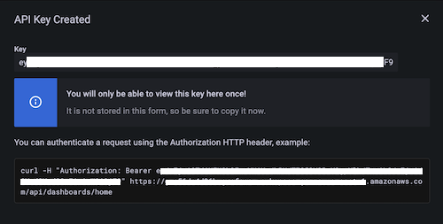

# Amazon Managed Grafana の自動化に Terraform を使用する

このレシピでは、Terraform を使用して Amazon Managed Grafana を自動化する方法を紹介します。
例えば、複数のワークスペースにわたってデータソースやダッシュボードを一貫して追加する方法などです。

:::note
    このガイドは約 30 分で完了します。
:::


## 前提条件

* ローカル環境に [AWS コマンドライン][aws-cli] がインストールされ、[設定][aws-cli-conf] されていること。
* ローカル環境に [Terraform][tf] コマンドラインがインストールされていること。
* 使用可能な Amazon Managed Service for Prometheus ワークスペースがあること。
* 使用可能な Amazon Managed Grafana ワークスペースがあること。


## Amazon Managed Grafana のセットアップ

Terraform が Grafana に対して[認証][grafana-authn]を行うために、パスワードのような役割を果たす API キーを使用します。

:::info
    API キーは、[RFC 6750][rfc6750] HTTP Bearer ヘッダーで、51 文字の英数字の値を持ち、Grafana API に対するすべてのリクエストで呼び出し元を認証します。
:::

そのため、Terraform マニフェストをセットアップする前に、まず API キーを作成する必要があります。これは Grafana UI を通じて以下のように行います。

まず、左側のメニューの `Configuration` セクションから `API keys` メニュー項目を選択します：


次に、新しい API キーを作成し、タスクに適した名前を付け、`Admin` ロールを割り当て、有効期間を例えば 1 日に設定します：


:::note
    API キーの有効期限は限られており、AMG では最大 30 日までの値を使用できます。
:::

`Add` ボタンをクリックすると、API キーを含むポップアップダイアログが表示されるはずです：



:::warning
    これが API キーを見られる唯一の機会です。ここから安全な場所に保存してください。後で Terraform マニフェストで必要になります。
:::

これで、Terraform を使用して自動化するために Amazon Managed Grafana で必要なすべてのセットアップが完了しました。次のステップに進みましょう。


## Terraform による自動化


### Terraform の準備

Terraform が Grafana と連携できるようにするため、バージョン 1.13.3 以上の公式 [Grafana プロバイダー][tf-grafana-provider] を使用します。

以下では、データソースの作成を自動化したいと考えています。具体的には、Prometheus [データソース][tf-ds]、正確には AMP ワークスペースを追加したいと思います。

まず、`main.tf` というファイルを作成し、以下の内容を記述します：

```
terraform {
  required_providers {
    grafana = {
      source  = "grafana/grafana"
      version = ">= 1.13.3"
    }
  }
}

provider "grafana" {
  url  = "ここに GRAFANA ワークスペース URL を挿入してください"
  auth = "ここに API キーを挿入してください"
}

resource "grafana_data_source" "prometheus" {
  type          = "prometheus"
  name          = "amp"
  is_default    = true
  url           = "ここに AMP ワークスペース URL を挿入してください"
  json_data {
	http_method     = "POST"
	sigv4_auth      = true
	sigv4_auth_type = "workspace-iam-role"
	sigv4_region    = "eu-west-1"
  }
}
```

上記のファイルには、環境に応じて 3 つの値を挿入する必要があります。

Grafana プロバイダーセクションでは：

* `url` … Grafana ワークスペース URL で、以下のような形式です：
      `https://xxxxxxxx.grafana-workspace.eu-west-1.amazonaws.com`。
* `auth` … 前のステップで作成した API キー。

Prometheus リソースセクションでは、`url` に AMP ワークスペース URL を挿入します。
形式は `https://aps-workspaces.eu-west-1.amazonaws.com/workspaces/ws-xxxxxxxxx` です。

:::note
    ファイルに示されているものとは異なるリージョンで Amazon Managed Grafana を使用している場合は、上記に加えて `sigv4_region` をお使いのリージョンに設定する必要があります。
:::

準備段階を締めくくるために、Terraform を初期化しましょう：

```
$ terraform init
Initializing the backend...

Initializing provider plugins...
- Finding grafana/grafana versions matching ">= 1.13.3"...
- Installing grafana/grafana v1.13.3...
- Installed grafana/grafana v1.13.3 (signed by a HashiCorp partner, key ID 570AA42029AE241A)

Partner and community providers are signed by their developers.
If you'd like to know more about provider signing, you can read about it here:
https://www.terraform.io/docs/cli/plugins/signing.html

Terraform has created a lock file .terraform.lock.hcl to record the provider
selections it made above. Include this file in your version control repository
so that Terraform can guarantee to make the same selections by default when
you run "terraform init" in the future.

Terraform has been successfully initialized!

You may now begin working with Terraform. Try running "terraform plan" to see
any changes that are required for your infrastructure. All Terraform commands
should now work.

If you ever set or change modules or backend configuration for Terraform,
rerun this command to reinitialize your working directory. If you forget, other
commands will detect it and remind you to do so if necessary.
```

これで準備が整い、以下で説明するようにデータソースの作成を Terraform で自動化できるようになりました。


### Terraform の使用

通常、まず Terraform の計画を次のように確認します：

```
$ terraform plan

Terraform used the selected providers to generate the following execution plan. 
Resource actions are indicated with the following symbols:
  + create

Terraform will perform the following actions:

  # grafana_data_source.prometheus will be created
  + resource "grafana_data_source" "prometheus" {
      + access_mode        = "proxy"
      + basic_auth_enabled = false
      + id                 = (known after apply)
      + is_default         = true
      + name               = "amp"
      + type               = "prometheus"
      + url                = "https://aps-workspaces.eu-west-1.amazonaws.com/workspaces/ws-xxxxxx/"

      + json_data {
          + http_method     = "POST"
          + sigv4_auth      = true
          + sigv4_auth_type = "workspace-iam-role"
          + sigv4_region    = "eu-west-1"
        }
    }

Plan: 1 to add, 0 to change, 0 to destroy.

───────────────────────────────────────────────────────────────────────────────────────────────────────────────────────────────────────────────────────────────────────────

Note: You didn't use the -out option to save this plan, so Terraform can't guarantee to take exactly these actions if you run "terraform apply" now.

```

表示された内容に問題がなければ、計画を適用できます：

```
$ terraform apply

Terraform used the selected providers to generate the following execution plan. 
Resource actions are indicated with the following symbols:
  + create

Terraform will perform the following actions:

  # grafana_data_source.prometheus will be created
  + resource "grafana_data_source" "prometheus" {
      + access_mode        = "proxy"
      + basic_auth_enabled = false
      + id                 = (known after apply)
      + is_default         = true
      + name               = "amp"
      + type               = "prometheus"
      + url                = "https://aps-workspaces.eu-west-1.amazonaws.com/workspaces/ws-xxxxxxxxx/"

      + json_data {
          + http_method     = "POST"
          + sigv4_auth      = true
          + sigv4_auth_type = "workspace-iam-role"
          + sigv4_region    = "eu-west-1"
        }
    }

Plan: 1 to add, 0 to change, 0 to destroy.

Do you want to perform these actions?
  Terraform will perform the actions described above.
  Only 'yes' will be accepted to approve.

  Enter a value: yes

grafana_data_source.prometheus: Creating...
grafana_data_source.prometheus: Creation complete after 1s [id=10]

Apply complete! Resources: 1 added, 0 changed, 0 destroyed.

```

これで Grafana のデータソースリストに移動すると、次のようなものが表示されるはずです：


新しく作成したデータソースが機能するかを確認するには、下部の青い `Save & test` ボタンをクリックします。結果として「Data source is working」という確認メッセージが表示されるはずです。

Terraform を使用して他の作業も自動化できます。例えば、[Grafana プロバイダー][tf-grafana-provider] はフォルダーやダッシュボードの管理をサポートしています。

例えば、ダッシュボードを整理するためのフォルダーを作成したい場合は次のようにします：

```
resource "grafana_folder" "examplefolder" {
  title = "devops"
}
```

さらに、`example-dashboard.json` というダッシュボードがあり、それを上記のフォルダーに作成したい場合は、次のスニペットを使用します：

```
resource "grafana_dashboard" "exampledashboard" {
  folder = grafana_folder.examplefolder.id
  config_json = file("example-dashboard.json")
}
```

Terraform は強力な自動化ツールであり、ここで示したように Grafana リソースの管理に使用できます。

:::note
    ただし、[Terraform の状態][tf-state] はデフォルトでローカルで管理されることに注意してください。つまり、Terraform を協調して使用する予定がある場合は、チーム間で状態を共有できる利用可能なオプションのいずれかを選択する必要があります。
:::


## クリーンアップ

コンソールから Amazon Managed Grafana ワークスペースを削除して、リソースを削除してください。

[aws-cli]: https://docs.aws.amazon.com/ja_jp/cli/latest/userguide/cli-chap-install.html
[aws-cli-conf]: https://docs.aws.amazon.com/ja_jp/cli/latest/userguide/cli-chap-configure.html
[tf]: https://www.terraform.io/downloads.html
[grafana-authn]: https://grafana.com/docs/grafana/latest/http_api/auth/
[rfc6750]: https://datatracker.ietf.org/doc/html/rfc6750
[tf-grafana-provider]: https://registry.terraform.io/providers/grafana/grafana/latest/docs
[tf-ds]: https://registry.terraform.io/providers/grafana/grafana/latest/docs/resources/data_source
[tf-state]: https://www.terraform.io/docs/language/state/remote.html
