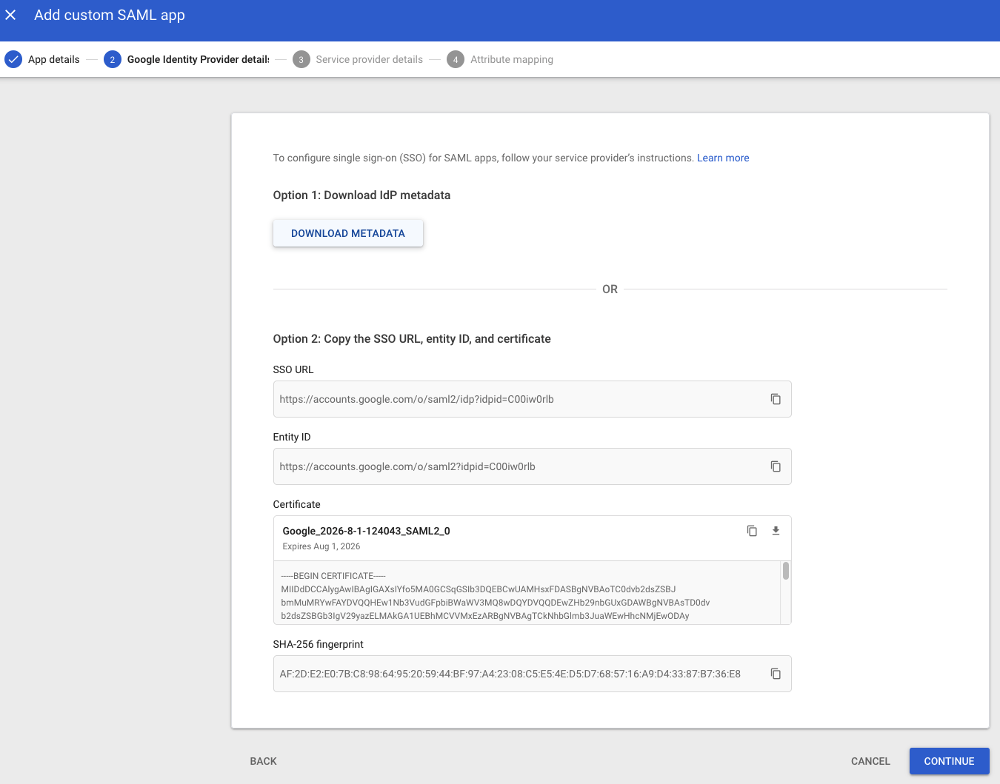
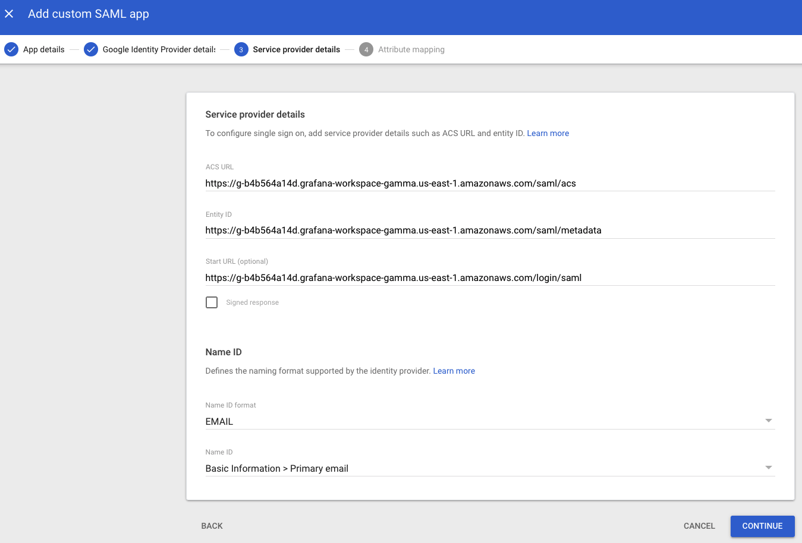

# SAML を使用して Amazon Managed Grafana で Google Workspace 認証を設定する

このガイドでは、SAML v2.0 プロトコルを使用して、Google Workspace を Amazon Managed Grafana のアイデンティティプロバイダー (IdP) として設定する方法を説明します。

このガイドに従うには、[Amazon Managed Grafana ワークスペース][amg-ws]を作成することに加えて、有料の [Google Workspace][google-workspaces] アカウントを作成する必要があります。

### Amazon Managed Grafana ワークスペースの作成

Amazon Managed Grafana コンソールにログインし、**ワークスペースの作成** をクリックします。次の画面で、
以下のようにワークスペース名を入力します。その後、**次へ** をクリックします：

**設定の構成** ページで、**Security Assertion Markup Language (SAML)** オプションを選択し、
ユーザーがログインするための SAML ベースの ID プロバイダーを設定できるようにします：

使用したいデータソースを選択し、**次へ** をクリックします：

**確認と作成** 画面で **ワークスペースの作成** ボタンをクリックします：

これにより、以下のように新しい Amazon Managed Grafana ワークスペースが作成されます：

### Google Workspace の設定

スーパー管理者権限で Google Workspace にログインし、**Apps** セクションの下にある **Web and mobile apps** に移動します。そこで、**Add App** をクリックし、**Add custom SAML app** を選択します。以下のように、アプリに名前を付けます。**CONTINUE** をクリックします。

次の画面で、**DOWNLOAD METADATA** ボタンをクリックして SAML メタデータファイルをダウンロードします。**CONTINUE** をクリックします。

次の画面では、ACS URL、Entity ID、Start URL フィールドが表示されます。
これらのフィールドの値は、Amazon Managed Grafana コンソールから取得できます。

**Name ID format** フィールドのドロップダウンから **EMAIL** を選択し、**Name ID** フィールドで **Basic Information > Primary email** を選択します。

**CONTINUE** をクリックします。

**Attribute mapping** 画面で、以下のスクリーンショットに示すように **Google Directory attributes** と **App attributes** の間のマッピングを行います。

Google 認証でログインするユーザーが **Amazon Managed Grafana** で **Admin** 権限を持つようにするには、**Department** フィールドの値を ***monitoring*** に設定します。このために任意のフィールドと値を選択できます。Google Workspace 側で何を使用するかを選択したら、Amazon Managed Grafana の SAML 設定でそれを反映するようにマッピングを行ってください。

### Amazon Managed Grafana に SAML メタデータをアップロードする

Amazon Managed Grafana コンソールで、**アップロードまたはコピー/ペースト** オプションをクリックし、**ファイルを選択** ボタンを選択して、先ほど Google Workspace からダウンロードした SAML メタデータファイルをアップロードします。

**アサーションマッピング** セクションで、**アサーション属性ロール** フィールドに **Department** と入力し、**管理者ロール値** フィールドに **monitoring** と入力します。
これにより、**Department** が **monitoring** である ユーザーが Grafana にログインすると、**管理者** 権限が付与され、ダッシュボードやデータソースの作成などの管理者の職務を実行できるようになります。

以下のスクリーンショットに示すように、**追加設定 - オプション** セクションの値を設定します。**SAML 設定を保存** をクリックします：

これで Amazon Managed Grafana が Google Workspace を使用してユーザーを認証するように設定されました。

ユーザーがログインすると、次のように Google のログインページにリダイレクトされます：

認証情報を入力すると、以下のスクリーンショットのように Grafana にログインされます。

ご覧のとおり、ユーザーは Google Workspace 認証を使用して Grafana に正常にログインできました。

[google-workspaces]: https://workspace.google.com/
[amg-ws]: https://docs.aws.amazon.com/ja_jp/grafana/latest/userguide/getting-started-with-AMG.html
