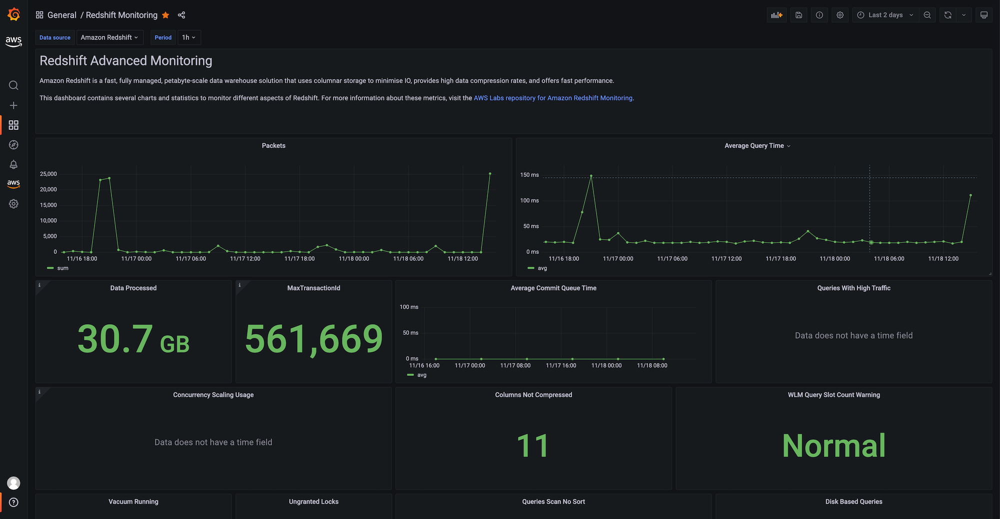

# Amazon Managed Grafana で Redshift を使用する

このレシピでは、標準 SQL を使用するペタバイトスケールのデータウェアハウスサービスである [Amazon Redshift][redshift] を [Amazon Managed Grafana][amg] で使用する方法を紹介します。
この統合は、[Grafana 用 Redshift データソース][redshift-ds] によって実現されています。
これはオープンソースのプラグインで、任意の DIY Grafana インスタンスで使用できるだけでなく、Amazon Managed Grafana にもプリインストールされています。

:::note
    このガイドは約 10 分で完了します。
:::

## 前提条件

1. アカウントから Amazon Redshift への管理者アクセス権があること。
2. Amazon Redshift クラスターに `GrafanaDataSource: true` というタグを付けること。
3. サービス管理ポリシーを利用するために、以下のいずれかの方法でデータベース認証情報を作成すること：
    1. デフォルトのメカニズム（一時的な認証情報オプション）を使用して Redshift データベースに対して認証を行う場合は、`redshift_data_api_user` という名前のデータベースユーザーを作成する必要があります。
    2. Secrets Manager の認証情報を使用する場合は、シークレットに `RedshiftQueryOwner: true` というタグを付ける必要があります。

:::tip
    サービス管理ポリシーまたはカスタムポリシーの使用方法の詳細については、[Amazon Managed Grafana ドキュメントの例][svpolicies] を参照してください。
:::

## インフラストラクチャ
Grafana インスタンスが必要なので、新しい [Amazon Managed Grafana ワークスペース][amg-workspace] をセットアップしてください。
例えば、[Getting Started][amg-getting-started] ガイドを使用するか、既存のものを使用してください。

:::note
    AWS データソース設定を使用するには、まず Amazon Managed Grafana コンソールに移動し、サービス管理の IAM ロールを有効にします。
    これにより、ワークスペースに Athena リソースを読み取るために必要な IAM ポリシーが付与されます。
:::

Athena データソースをセットアップするには、左側のツールバーを使用して、下部の AWS アイコンを選択し、次に「Redshift」を選択します。
プラグインが使用する Redshift データソースを検出するデフォルトのリージョンを選択し、使用するアカウントを選択してから、「Add data source」を選択します。

または、以下の手順に従って Redshift データソースを手動で追加および設定することもできます：

1. 左側のツールバーの「Configurations」アイコンをクリックし、次に「Add data source」をクリックします。
1. 「Redshift」を検索します。
1. [オプション] 認証プロバイダーを設定します（推奨：ワークスペース IAM ロール）。
1. 「Cluster Identifier」、「Database」、「Database User」の値を入力します。
1. 「Save & test」をクリックします。

以下のような画面が表示されるはずです：

## 使用方法
[Redshift Advance Monitoring][redshift-mon] のセットアップを使用します。
すべてがすぐに利用可能なので、この時点で他に設定する必要はありません。

Redshift プラグインに含まれる Redshift モニタリングダッシュボードをインポートできます。
インポートすると、次のような画面が表示されるはずです：

ここから、以下のガイドを使用して Amazon Managed Grafana で独自のダッシュボードを作成できます：

* [ユーザーガイド：ダッシュボード](https://docs.aws.amazon.com/ja_jp/grafana/latest/userguide/dashboard-overview.html)
* [ダッシュボード作成のベストプラクティス](https://grafana.com/docs/grafana/latest/best-practices/best-practices-for-creating-dashboards/)

以上です。おめでとうございます！Grafana から Redshift を使用する方法を学びました！

## クリーンアップ

使用していた Redshift データベースを削除し、その後コンソールから Amazon Managed Grafana ワークスペースを削除してください。

[redshift]: https://aws.amazon.com/jp/redshift/
[amg]: https://aws.amazon.com/jp/grafana/
[svpolicies]: https://docs.aws.amazon.com/ja_jp/grafana/latest/userguide/security_iam_id-based-policy-examples.html
[redshift-ds]: https://grafana.com/grafana/plugins/grafana-redshift-datasource/
[aws-cli]: https://docs.aws.amazon.com/ja_jp/cli/latest/userguide/cli-chap-install.html
[aws-cli-conf]: https://docs.aws.amazon.com/ja_jp/cli/latest/userguide/cli-chap-configure.html
[amg-getting-started]: https://aws.amazon.com/jp/blogs/news/amazon-managed-grafana-getting-started/
[redshift-console]: https://console.aws.amazon.com/redshift/
[redshift-mon]: https://github.com/awslabs/amazon-redshift-monitoring
[amg-workspace]: https://console.aws.amazon.com/grafana/home#/workspaces
