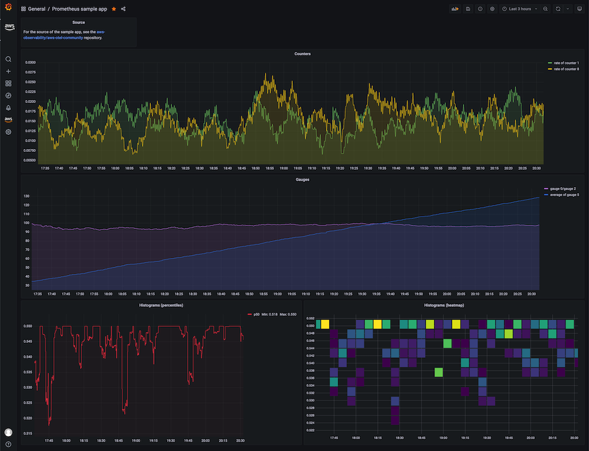

# EKS on EC2 で AWS Distro for OpenTelemetry を使用し、Amazon Managed Service for Prometheus と連携する

このレシピでは、[サンプル Go アプリケーション](https://github.com/aws-observability/aws-otel-community/tree/master/sample-apps/prometheus-sample-app)に計装を行い、[AWS Distro for OpenTelemetry (ADOT)](https://aws.amazon.com/jp/otel) を使用して [Amazon Managed Service for Prometheus (AMP)](https://aws.amazon.com/jp/prometheus/) にメトリクスを取り込む方法を紹介します。
そして、[Amazon Managed Grafana (AMG)](https://aws.amazon.com/jp/grafana/) を使用してメトリクスを可視化します。

完全なシナリオを示すために、[Amazon Elastic Kubernetes Service (EKS)](https://aws.amazon.com/jp/eks/) on EC2 クラスターと [Amazon Elastic Container Registry (ECR)](https://aws.amazon.com/jp/ecr/) リポジトリをセットアップします。

:::note
    このガイドは完了までに約 1 時間かかります。
:::


## インフラストラクチャ
以下のセクションでは、このレシピのインフラストラクチャをセットアップします。


### アーキテクチャ

ADOT パイプラインを使用することで、[ADOT Collector](https://github.com/aws-observability/aws-otel-collector) を利用して Prometheus で計装されたアプリケーションからメトリクスを収集し、収集したメトリクスを Amazon Managed Service for Prometheus に取り込むことができます。


ADOT Collector には、Prometheus に特化した 2 つのコンポーネントが含まれています：

* Prometheus Receiver
* AWS Prometheus Remote Write Exporter

:::info
    Prometheus Remote Write Exporter の詳細については、以下をご覧ください：
    [Getting Started with Prometheus Remote Write Exporter for AMP](https://aws-otel.github.io/docs/getting-started/prometheus-remote-write-exporter)
:::


### 前提条件

* AWS CLI が環境に[インストール](https://docs.aws.amazon.com/ja_jp/cli/latest/userguide/cli-chap-install.html)され、[設定](https://docs.aws.amazon.com/ja_jp/cli/latest/userguide/cli-chap-configure.html)されていること。
* 環境に [eksctl](https://docs.aws.amazon.com/ja_jp/eks/latest/userguide/eksctl.html) コマンドをインストールする必要があります。
* 環境に [kubectl](https://docs.aws.amazon.com/ja_jp/eks/latest/userguide/install-kubectl.html) をインストールする必要があります。
* 環境に [docker](https://docs.docker.com/get-docker/) がインストールされていること。


### EC2 上に EKS クラスターを作成する

このレシピのデモアプリケーションは EKS 上で実行されます。
既存の EKS クラスターを使用するか、[cluster-config.yaml](./ec2-eks-metrics-go-adot-ampamg/cluster-config.yaml) を使用して新しいクラスターを作成することができます。

このテンプレートは、2 つの EC2 `t2.large` ノードを持つ新しいクラスターを作成します。

テンプレートファイルを編集し、`<YOUR_REGION>` を [AMP がサポートしているリージョン](https://docs.aws.amazon.com/ja_jp/prometheus/latest/userguide/what-is-Amazon-Managed-Service-Prometheus.html) のいずれかに設定してください。

セッションで `<YOUR_REGION>` を上書きしてください。例えば、bash では以下のようにします：
```
export AWS_DEFAULT_REGION=<YOUR_REGION>
```

以下のコマンドを使用してクラスターを作成します。
```
eksctl create cluster -f cluster-config.yaml
```


### ECR リポジトリのセットアップ

EKS にアプリケーションをデプロイするには、コンテナレジストリが必要です。
以下のコマンドを使用して、アカウントに新しい ECR レジストリを作成できます。
`<YOUR_REGION>` も必ず設定してください。

```
aws ecr create-repository \
    --repository-name prometheus-sample-app \
    --image-scanning-configuration scanOnPush=true \
    --region <YOUR_REGION>
```


### AMP のセットアップ

AWS CLI を使用してワークスペースを作成します
```
aws amp create-workspace --alias prometheus-sample-app
```

以下のコマンドを使用してワークスペースが作成されたことを確認します：
```
aws amp list-workspaces
```

:::info
    詳細については、[AMP 入門ガイド](https://docs.aws.amazon.com/ja_jp/prometheus/latest/userguide/AMP-getting-started.html)をご覧ください。
:::


### ADOT Collector のセットアップ

[adot-collector-ec2.yaml](./ec2-eks-metrics-go-adot-ampamg/adot-collector-ec2.yaml) をダウンロードし、次のステップで説明するパラメータでこの YAML ドキュメントを編集します。

この例では、ADOT Collector の設定でアノテーション `(scrape=true)` を使用して、スクレイピングするターゲットエンドポイントを指定しています。
これにより、ADOT Collector はクラスター内のサンプルアプリのエンドポイントを `kube-system` エンドポイントと区別できます。
別のサンプルアプリをスクレイピングしたい場合は、再ラベル設定からこれを削除できます。

ダウンロードしたファイルを環境に合わせて編集するには、以下の手順に従ってください：

1\. `<YOUR_REGION>` を現在のリージョンに置き換えます。

2\. `<YOUR_ENDPOINT>` をワークスペースのリモートライト URL に置き換えます。

以下のクエリを実行して、AMP リモートライト URL エンドポイントを取得します。

まず、次のようにワークスペース ID を取得します：

```
YOUR_WORKSPACE_ID=$(aws amp list-workspaces \
                    --alias prometheus-sample-app \
                    --query 'workspaces[0].workspaceId' --output text)
```

次に、以下を使用してワークスペースのリモートライト URL エンドポイントを取得します：

```
YOUR_ENDPOINT=$(aws amp describe-workspace \
                --workspace-id $YOUR_WORKSPACE_ID  \
                --query 'workspace.prometheusEndpoint' --output text)api/v1/remote_write
```

:::warning
    `YOUR_ENDPOINT` が実際にリモートライト URL であることを確認してください。
    つまり、URL は `/api/v1/remote_write` で終わっている必要があります。
:::

デプロイメントファイルを作成したら、以下のコマンドを使用してクラスターに適用できます：

```
kubectl apply -f adot-collector-ec2.yaml
```

:::info
    詳細については、[AWS Distro for OpenTelemetry (ADOT) Collector のセットアップ](https://aws-otel.github.io/docs/getting-started/prometheus-remote-write-exporter/eks#aws-distro-for-opentelemetry-adot-collector-setup) をご覧ください。
:::


### AMG のセットアップ

[Amazon Managed Grafana – はじめに](https://aws.amazon.com/jp/blogs/news/amazon-managed-grafana-getting-started/) ガイドを使用して、新しい AMG ワークスペースをセットアップします。

作成時に、データソースとして「Amazon Managed Service for Prometheus」を必ず追加してください。


## アプリケーション

このレシピでは、AWS Observability リポジトリにある [サンプルアプリケーション](https://github.com/aws-observability/aws-otel-community/tree/master/sample-apps/prometheus) を使用します。

この Prometheus サンプルアプリは、Prometheus の 4 つのメトリクスタイプ（カウンター、ゲージ、ヒストグラム、サマリー）をすべて生成し、`/metrics` エンドポイントで公開します。


### コンテナイメージのビルド

コンテナイメージをビルドするには、まず Git リポジトリをクローンし、以下のようにディレクトリを変更します：

```
git clone https://github.com/aws-observability/aws-otel-community.git && \
cd ./aws-otel-community/sample-apps/prometheus
```

まず、リージョン（上記で設定していない場合）とアカウント ID を、お使いの環境に適用できるように設定します。
`<YOUR_REGION>` を現在のリージョンに置き換えてください。
例えば、Bash シェルでは以下のようになります：

```
export AWS_DEFAULT_REGION=<YOUR_REGION>
export ACCOUNTID=`aws sts get-caller-identity --query Account --output text`
```

次に、コンテナイメージをビルドします：

```
docker build . -t "$ACCOUNTID.dkr.ecr.$AWS_DEFAULT_REGION.amazonaws.com/prometheus-sample-app:latest"
```

:::note
    プロキシや i/o タイムアウトにより環境で `go mod` が失敗する場合、Dockerfile を編集して go mod プロキシをバイパスすることができます。

    Dockerfile の以下の行を変更してください：
    ```
    RUN GO111MODULE=on go mod download
    ```
    を以下のように変更：
    ```
    RUN GOPROXY=direct GO111MODULE=on go mod download
    ```
:::

これで、先ほど作成した ECR リポジトリにコンテナイメージをプッシュできます。

そのために、まずデフォルトの ECR レジストリにログインします：

```
aws ecr get-login-password --region $AWS_DEFAULT_REGION | \
    docker login --username AWS --password-stdin \
    "$ACCOUNTID.dkr.ecr.$AWS_DEFAULT_REGION.amazonaws.com"
```

最後に、先ほど作成した ECR リポジトリにコンテナイメージをプッシュします：

```
docker push "$ACCOUNTID.dkr.ecr.$AWS_DEFAULT_REGION.amazonaws.com/prometheus-sample-app:latest"
```


### サンプルアプリのデプロイ

[prometheus-sample-app.yaml](./ec2-eks-metrics-go-adot-ampamg/prometheus-sample-app.yaml) を編集して、あなたの ECR イメージパスを含めてください。
つまり、ファイル内の `ACCOUNTID` と `AWS_DEFAULT_REGION` をあなた自身の値に置き換えてください：

```
    # 以下をあなたのコンテナイメージに変更してください：
    image: "ACCOUNTID.dkr.ecr.AWS_DEFAULT_REGION.amazonaws.com/prometheus-sample-app:latest"
```

これで、以下のコマンドを使用してサンプルアプリをクラスターにデプロイできます：

```
kubectl apply -f prometheus-sample-app.yaml
```


## エンド・ツー・エンド

インフラストラクチャとアプリケーションが整ったので、セットアップをテストします。
EKS で実行されている Go アプリから AMP にメトリクスを送信し、AMG で可視化します。


### パイプラインが機能していることを確認する

ADOT コレクターがサンプルアプリの Pod をスクレイピングし、メトリクスを AMP に取り込んでいるかを確認するために、コレクターのログを確認します。

以下のコマンドを入力して、ADOT コレクターのログをフォローします：

```
kubectl -n adot-col logs adot-collector -f
```

サンプルアプリからスクレイピングされたメトリクスのログの出力例は、以下のようになります：

```
...
Resource labels:
     -> service.name: STRING(kubernetes-service-endpoints)
     -> host.name: STRING(192.168.16.238)
     -> port: STRING(8080)
     -> scheme: STRING(http)
InstrumentationLibraryMetrics #0
Metric #0
Descriptor:
     -> Name: test_gauge0
     -> Description: This is my gauge
     -> Unit:
     -> DataType: DoubleGauge
DoubleDataPoints #0
StartTime: 0
Timestamp: 1606511460471000000
Value: 0.000000
...
```

:::tip
    AMP がメトリクスを受信したかを確認するには、[awscurl](https://github.com/okigan/awscurl) を使用できます。
    このツールを使用すると、コマンドラインから AWS Sigv4 認証を使用して HTTP リクエストを送信できます。
    そのため、AMP からクエリを実行するための適切な権限を持つ AWS 認証情報をローカルに設定しておく必要があります。
    以下のコマンドで、`$AMP_ENDPOINT` を AMP ワークスペースのエンドポイントに置き換えてください：

    ```
    $ awscurl --service="aps" \
            --region="$AWS_DEFAULT_REGION" "https://$AMP_ENDPOINT/api/v1/query?query=adot_test_gauge0"
    {"status":"success","data":{"resultType":"vector","result":[{"metric":{"__name__":"adot_test_gauge0"},"value":[1606512592.493,"16.87214000011479"]}]}}
    ```
:::


### Grafana ダッシュボードの作成

サンプルアプリ用のダッシュボードの例を、[prometheus-sample-app-dashboard.json](./ec2-eks-metrics-go-adot-ampamg/prometheus-sample-app-dashboard.json) からインポートできます。
以下のようなダッシュボードが表示されます：



さらに、以下のガイドを使用して Amazon Managed Grafana で独自のダッシュボードを作成できます：

* [ユーザーガイド：ダッシュボード](https://docs.aws.amazon.com/ja_jp/grafana/latest/userguide/dashboard-overview.html)
* [ダッシュボード作成のベストプラクティス](https://grafana.com/docs/grafana/latest/best-practices/best-practices-for-creating-dashboards/)

以上です。おめでとうございます！EC2 上の EKS で ADOT を使用してメトリクスを取り込む方法を学びました。


## クリーンアップ

1. リソースとクラスターを削除します
```
kubectl delete all --all
eksctl delete cluster --name amp-eks-ec2
```
2. AMP ワークスペースを削除します
```
aws amp delete-workspace --workspace-id `aws amp list-workspaces --alias prometheus-sample-app --query 'workspaces[0].workspaceId' --output text`
```
3. amp-iamproxy-ingest-role IAM ロールを削除します
```
aws delete-role --role-name amp-iamproxy-ingest-role
```
4. コンソールから AMG ワークスペースを削除します。
