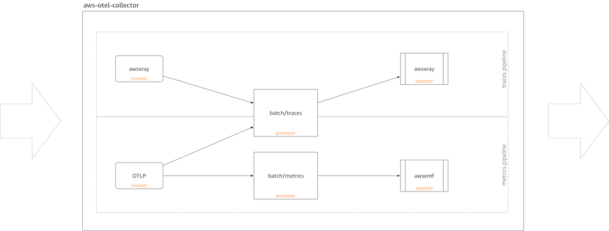
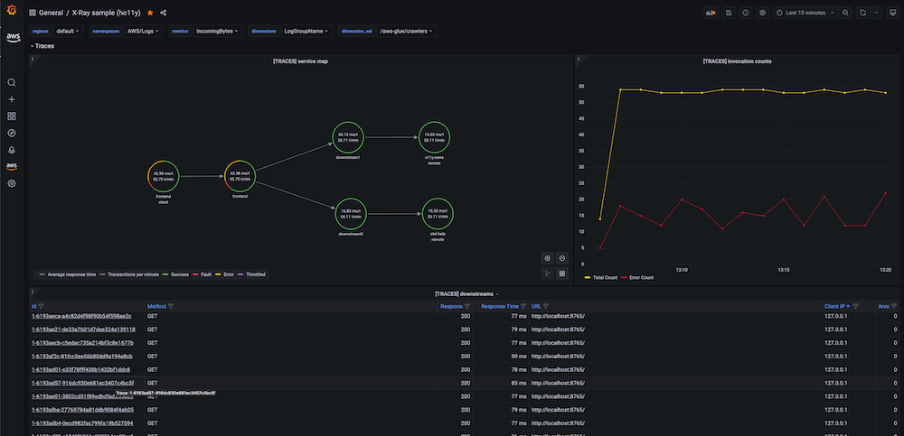

# EKS on Fargate で AWS Distro for OpenTelemetry を AWS X-Ray と共に使用する

このレシピでは、サンプル Go アプリケーションを計装し、[AWS Distro for OpenTelemetry (ADOT)](https://aws.amazon.com/jp/otel) を使用して [AWS X-Ray](https://aws.amazon.com/jp/xray/) にトレースを取り込み、[Amazon Managed Grafana](https://aws.amazon.com/jp/grafana/) でトレースを可視化する方法を紹介します。

完全なシナリオを示すために、[AWS Fargate](https://aws.amazon.com/jp/fargate/) 上に [Amazon Elastic Kubernetes Service (EKS)](https://aws.amazon.com/jp/eks/) クラスターをセットアップし、[Amazon Elastic Container Registry (ECR)](https://aws.amazon.com/jp/ecr/) リポジトリを使用します。

:::note
    このガイドは完了までに約 1 時間かかります。
:::


## インフラストラクチャ
以下のセクションでは、このレシピのインフラストラクチャをセットアップします。


### アーキテクチャ

ADOT パイプラインを使用すると、[ADOT Collector](https://github.com/aws-observability/aws-otel-collector) を使用して、計装されたアプリケーションからトレースを収集し、X-Ray に取り込むことができます。




### 前提条件

* AWS CLI が環境に[インストール](https://docs.aws.amazon.com/ja_jp/cli/latest/userguide/cli-chap-install.html)され、[設定](https://docs.aws.amazon.com/ja_jp/cli/latest/userguide/cli-chap-configure.html)されていること。
* 環境に [eksctl](https://docs.aws.amazon.com/ja_jp/eks/latest/userguide/eksctl.html) コマンドをインストールする必要があります。
* 環境に [kubectl](https://docs.aws.amazon.com/ja_jp/eks/latest/userguide/install-kubectl.html) をインストールする必要があります。
* 環境に [Docker](https://docs.docker.com/get-docker/) がインストールされていること。
* [aws-observability/aws-o11y-recipes](https://github.com/aws-observability/aws-o11y-recipes/) リポジトリがローカル環境にクローンされていること。


### Fargate 上の EKS クラスターを作成する

デモアプリケーションは Kubernetes アプリで、Fargate 上の EKS クラスターで実行します。
まず、提供されている [cluster_config.yaml](./fargate-eks-xray-go-adot-amg/cluster-config.yaml) を使用して EKS クラスターを作成します。

以下のコマンドを使用してクラスターを作成してください：

```
eksctl create cluster -f cluster-config.yaml
```


### ECR リポジトリの作成

アプリケーションを EKS にデプロイするには、コンテナリポジトリが必要です。
ここでは、プライベートの ECR レジストリを使用しますが、コンテナイメージを共有したい場合は ECR Public を使用することもできます。

まず、以下のように環境変数を設定します（お使いのリージョンに置き換えてください）：

```
export REGION="eu-west-1"
export ACCOUNTID=`aws sts get-caller-identity --query Account --output text`
```

次のコマンドを使用して、アカウントに新しい ECR リポジトリを作成できます：

```
aws ecr create-repository \
    --repository-name ho11y \
    --image-scanning-configuration scanOnPush=true \
    --region $REGION
```


### ADOT Collector のセットアップ

[adot-collector-fargate.yaml](./fargate-eks-xray-go-adot-amg/adot-collector-fargate.yaml) をダウンロードし、次のステップで説明するパラメータでこの YAML ドキュメントを編集します。

```
kubectl apply -f adot-collector-fargate.yaml
```


### Managed Grafana のセットアップ

[Amazon Managed Grafana - はじめに](https://aws.amazon.com/jp/blogs/news/amazon-managed-grafana-getting-started/) ガイドを使用して新しいワークスペースをセットアップし、[X-Ray をデータソースとして追加](https://docs.aws.amazon.com/ja_jp/grafana/latest/userguide/x-ray-data-source.html) します。


## シグナルジェネレーター

レシピリポジトリの [サンドボックス](https://github.com/aws-observability/observability-best-practices/tree/main/sandbox/ho11y) で利用可能な合成シグナルジェネレーター `ho11y` を使用します。
まだリポジトリをローカル環境にクローンしていない場合は、今すぐクローンしてください：

```
git clone https://github.com/aws-observability/aws-o11y-recipes.git
```


### コンテナイメージのビルド
`ACCOUNTID` と `REGION` 環境変数が設定されていることを確認してください。
例えば：

```
export REGION="eu-west-1"
export ACCOUNTID=`aws sts get-caller-identity --query Account --output text`
```
`ho11y` コンテナイメージをビルドするには、まず `./sandbox/ho11y/` ディレクトリに移動し、コンテナイメージをビルドします：

:::note
    以下のビルド手順では、Docker デーモンまたは同等の OCI イメージビルドツールが実行されていることを前提としています。
:::

```
docker build . -t "$ACCOUNTID.dkr.ecr.$REGION.amazonaws.com/ho11y:latest"
```


### コンテナイメージのプッシュ
次に、先ほど作成した ECR リポジトリにコンテナイメージをプッシュできます。
そのために、まずデフォルトの ECR レジストリにログインします：

```
aws ecr get-login-password --region $REGION | \
    docker login --username AWS --password-stdin \
    "$ACCOUNTID.dkr.ecr.$REGION.amazonaws.com"
```

最後に、先ほど作成した ECR リポジトリにコンテナイメージをプッシュします：

```
docker push "$ACCOUNTID.dkr.ecr.$REGION.amazonaws.com/ho11y:latest"
```


### シグナル生成器のデプロイ

[x-ray-sample-app.yaml](./fargate-eks-xray-go-adot-amg/x-ray-sample-app.yaml) を編集して、あなたの ECR イメージパスを含めてください。
つまり、ファイル内の `ACCOUNTID` と `REGION` を自分の値に置き換えてください（全体で 3 箇所あります）：

```
    # 以下をあなたのコンテナイメージに変更してください：
    image: "ACCOUNTID.dkr.ecr.REGION.amazonaws.com/ho11y:latest"
```

これで、以下のコマンドを使用してサンプルアプリをクラスターにデプロイできます：

```
kubectl -n example-app apply -f x-ray-sample-app.yaml
```


## エンド・ツー・エンド

インフラストラクチャとアプリケーションが整ったので、セットアップをテストします。
EKS で実行されている `ho11y` から X-Ray にトレースを送信し、AMG で可視化します。


### パイプラインの検証

ADOT コレクターが `ho11y` からトレースを取り込んでいるかを確認するために、サービスの 1 つをローカルで利用可能にして呼び出します。

まず、以下のようにトラフィックを転送します：

```
kubectl -n example-app port-forward svc/frontend 8765:80
```

上記のコマンドにより、`frontend` マイクロサービス（他の 2 つの `ho11y` インスタンスと通信するように設定された `ho11y` インスタンス）がローカル環境で利用可能になり、以下のように呼び出すことができます（トレースの作成をトリガーします）：

```
$ curl localhost:8765/
{"traceId":"1-6193a9be-53693f29a0119ee4d661ba0d"}
```

:::tip
    呼び出しを自動化したい場合は、`curl` コールを `while true` ループでラップすることができます。
:::

セットアップを確認するには、[CloudWatch の X-Ray ビュー](https://console.aws.amazon.com/cloudwatch/home#xray:service-map/) にアクセスしてください。以下のような画面が表示されるはずです：


これでシグナル生成器のセットアップが完了し、アクティブになり、OpenTelemetry パイプラインもセットアップされました。次に、Grafana でトレースを消費する方法を見ていきましょう。


### Grafana ダッシュボード

[x-ray-sample-dashboard.json](./fargate-eks-xray-go-adot-amg/x-ray-sample-dashboard.json) で利用可能なサンプルダッシュボードをインポートできます。
以下のように表示されます：



さらに、下部の `downstreams` パネルにあるトレースのいずれかをクリックすると、詳細を確認し、「Explore」タブで次のように表示できます：


ここから、以下のガイドを使用して Amazon Managed Grafana で独自のダッシュボードを作成できます：

* [ユーザーガイド：ダッシュボード](https://docs.aws.amazon.com/ja_jp/grafana/latest/userguide/dashboard-overview.html)
* [ダッシュボード作成のベストプラクティス](https://grafana.com/docs/grafana/latest/best-practices/best-practices-for-creating-dashboards/)

以上です。おめでとうございます！Fargate 上の EKS で ADOT を使用してトレースを取り込む方法を学びました。


## クリーンアップ

まず、Kubernetes リソースを削除し、EKS クラスターを破棄します。

```
kubectl delete all --all && \
eksctl delete cluster --name xray-eks-fargate
```

最後に、AWS コンソールを使用して Amazon Managed Grafana ワークスペースを削除します。
