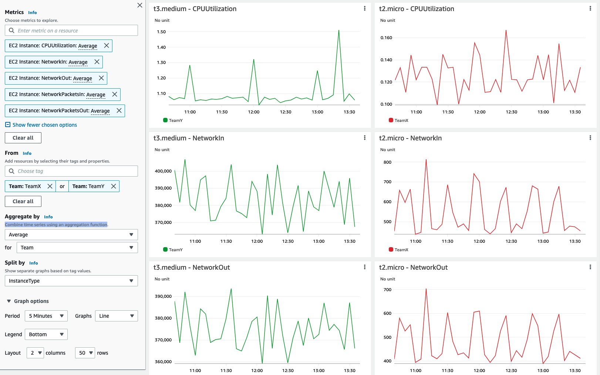

# リソースタグでフィルタリングしたメトリクスを集計および可視化するために Amazon CloudWatch メトリクスエクスプローラーを使用する

このレシピでは、リソースタグとリソースプロパティでメトリクスをフィルタリング、集計、可視化するためにメトリクスエクスプローラーを使用する方法を示します - [タグとプロパティでリソースをモニタリングするメトリクスエクスプローラーを使用する][metrics-explorer]。

メトリクスエクスプローラーで可視化を作成する方法はいくつかあります。このチュートリアルでは、単純に AWS コンソールを利用します。

:::note
    このガイドを完了するのに約 5 分かかります。
:::
## 前提条件

* AWS アカウントへのアクセス権
* AWS コンソール経由での Amazon CloudWatch Metrics explorer へのアクセス権
* 関連リソースに対してリソースタグが設定されていること

## タグベースのクエリとビジュアライゼーションを使用したメトリクスエクスプローラー

* CloudWatch コンソールを開きます

* **Metrics** の下の **Explorer** メニューをクリックします

* **Generic templates** または **Service based templates** リストからテンプレートを選択できます。この例では **EC2 Instances by type** テンプレートを使用します。

* 調査したいメトリクスを選択します。不要なものは削除し、表示したい他のメトリクスを追加します。

* **From** の下で、検索したいリソースタグまたはリソースプロパティを選択します。以下の例では、**Name: TeamX** タグが付いた異なる EC2 インスタンスの CPU およびネットワーク関連メトリクスの数を示しています。

* **Aggregated by** の下の集計関数を使用して、タイムシリーズを組み合わせることができることに注意してください。以下の例では、**TeamX** メトリクスが **Availability Zone** 別に集計されています。

あるいは、**Team** タグで **TeamX** と **TeamY** を集計するなど、ニーズに合った他の構成を選択できます。

## 動的なビジュアライゼーション
<b>From</b>、<b>Aggregated by</b>、<b>Split by</b> のオプションを使用することで、結果のビジュアライゼーションを簡単にカスタマイズできます。
メトリクスエクスプローラーのビジュアライゼーションは動的なので、新しくタグ付けされたリソースは自動的にエクスプローラーウィジェットに表示されます。

## 参考情報

メトリクスエクスプローラの詳細については、以下の記事を参照してください。
https://docs.aws.amazon.com/ja_jp/AmazonCloudWatch/latest/monitoring/CloudWatch-Metrics-Explorer.html

[metrics-explorer]: https://docs.aws.amazon.com/ja_jp/AmazonCloudWatch/latest/monitoring/CloudWatch-Metrics-Explorer.html
