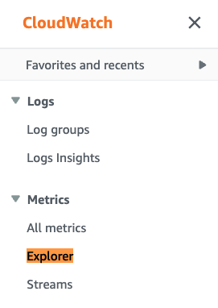
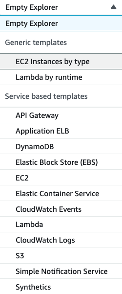
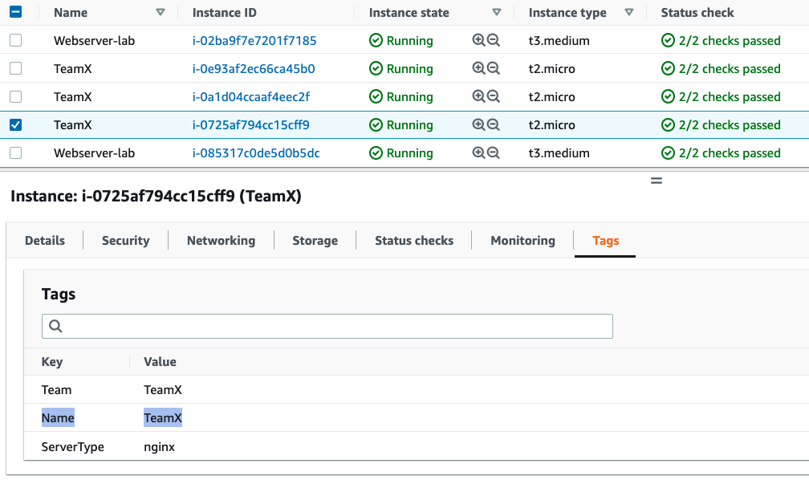

# リソースタグでフィルタリングされたメトリクスを集約・可視化するための Amazon CloudWatch Metrics explorer の使用

このレシピでは、Metrics explorer を使用してリソースタグとリソースプロパティによるメトリクスのフィルタリング、集約、可視化の方法を紹介します - [タグとプロパティによるリソースのモニタリングに Metrics explorer を使用する][metrics-explorer]。

Metrics explorer を使用して可視化を作成する方法はいくつかありますが、このウォークスルーでは AWS コンソールを活用します。

:::note
    このガイドは約 5 分で完了します。
:::

## 前提条件

* AWS アカウントへのアクセス
* AWS コンソールを介した Amazon CloudWatch Metrics explorer へのアクセス
* 関連リソースに設定されたリソースタグ

## タグベースのクエリと可視化を使用した Metrics Explorer

* CloudWatch コンソールを開きます

* <b>メトリクス</b> の下にある <b>Explorer</b> メニューをクリックします

* <b>汎用テンプレート</b> または <b>サービスベースのテンプレート</b> リストから選択できます。この例では、<b>タイプ別 EC2 インスタンス</b> テンプレートを使用します

* 探索したいメトリクスを選択します。不要なものを削除し、表示したい他のメトリクスを追加します

* <b>From</b> の下で、探しているリソースタグまたはリソースプロパティを選択します。以下の例では、<b>Name: TeamX</b> タグを持つ異なる EC2 インスタンスの CPU とネットワーク関連のメトリクス数を表示しています

* <b>Aggregated by</b> の下で集計関数を使用して時系列を組み合わせることができます。以下の例では、<b>TeamX</b> のメトリクスが <b>アベイラビリティーゾーン</b> で集計されています

あるいは、<b>TeamX</b> と <b>TeamY</b> を <b>Team</b> タグで集計したり、ニーズに合わせて他の設定を選択したりすることもできます

## 動的な可視化

<b>From</b>、<b>Aggregated by</b>、<b>Split by</b> オプションを使用して、結果の可視化を簡単にカスタマイズできます。メトリクスエクスプローラーの可視化は動的であるため、新しくタグ付けされたリソースは自動的にエクスプローラーウィジェットに表示されます。

## リファレンス

Metrics explorer の詳細については、以下の記事を参照してください：
https://docs.aws.amazon.com/ja_jp/AmazonCloudWatch/latest/monitoring/CloudWatch-Metrics-Explorer.html

[metrics-explorer]: https://docs.aws.amazon.com/ja_jp/AmazonCloudWatch/latest/monitoring/CloudWatch-Metrics-Explorer.html
