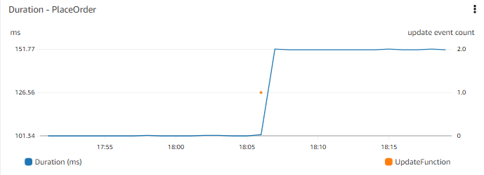
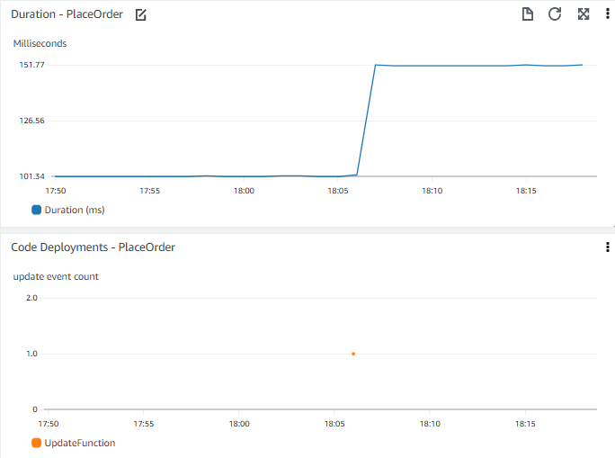

# イベント

## イベントとは何を意味するのでしょうか？
最近では、多くのアーキテクチャがイベント駆動型になっています。イベント駆動型アーキテクチャでは、イベントは異なるシステムからのシグナルであり、それを捕捉して他のシステムに渡します。イベントは通常、状態の変化や更新を表します。

例えば、eコマースシステムでは、商品がカートに追加されたときにイベントが発生する可能性があります。このイベントを捕捉し、システムのショッピングカート部分に渡して、カート内のアイテム数と合計金額を更新し、商品の詳細情報も含めることができます。

:::info
一部の顧客にとって、イベントは購入完了などの *マイルストーン* かもしれません。ワークフローの結論に至る総合的な瞬間をイベントとして扱う考え方もありますが、ここではマイルストーン自体をイベントとは考えません。
:::

## イベントが有用な理由

イベントは、オブザーバビリティソリューションにおいて主に 2 つの方法で役立ちます。1 つは他のデータのコンテキストでイベントを可視化すること、もう 1 つはイベントに基づいてアクションを取ることができるようにすることです。

:::info
イベントは、ワークロードの変更やアクションについて、人間や機械に価値ある情報を提供することを目的としています。
:::

## イベントの可視化
アプリケーションから直接得られるものではありませんが、アプリケーションのパフォーマンスに影響を与えたり、根本原因の追加的な洞察を提供したりする多くのイベントシグナルがあります。ダッシュボードはイベントを可視化する最も一般的なメカニズムですが、一部の分析やビジネスインテリジェンスツールもこの文脈で機能します。電子メールやインスタントメッセージングアプリケーションでも、容易に可視化を受け取ることができます。

ウェブフロントエンドでの注文にかかる時間など、アプリケーションのパフォーマンスの時系列チャートを考えてみましょう。時系列チャートを見ると、数日前に応答時間に段階的な変化があったことがわかります。最近デプロイメントがあったかどうかを知ることは有用かもしれません。最近のデプロイメントの時系列チャートを並べて、あるいは同じチャート上に重ねて表示できることを考えてみてください。

:::tip
より広い文脈を理解するために、どのイベントが有用かを考えてみてください。あなたにとって重要なイベントは、コードのデプロイメント、インフラストラクチャの変更イベント、新しいデータの追加（新商品の公開や新規ユーザーの一括追加など）、機能の変更や追加（カートへの商品追加方法の変更など）かもしれません。
:::

:::info
重要なメトリクスデータと共にイベントを可視化することで、[イベントを相関付け](../signals/metrics/#correlate-with-operational-metric-data)ることができます。
:::

## イベントに対するアクション

オブザーバビリティの世界では、アラームの発生は一般的なイベントです。このイベントには通常、アラームの識別子、アラームの状態（「IN ALARM」や「OK」など）、およびトリガーの詳細が含まれます。多くの場合、このアラームイベントが検出され、メール通知が送信されます。これはアラームに対するアクションの一例です。

アラーム通知はオブザーバビリティにおいて重要です。これにより、問題が発生したことを適切な人々に知らせることができます。しかし、オブザーバビリティソリューションでイベントに対するアクションが成熟すると、人間の介入なしに問題を自動的に修復することができるようになります。

### しかし、どのようなアクションを取るべきか？
検出された問題を緩和するためのアクションを理解せずに、自動化することはできません。オブザーバビリティの旅の始まりでは、これが明確でない場合がよくあります。しかし、問題を修正する経験を積むほど、既知のアクションがある領域を捉えるようにアラームを微調整できるようになります。アラームサービスに組み込まれたアクションがある場合もあれば、アラームイベントを自分でキャプチャして解決をスクリプト化する必要がある場合もあります。

:::info
	[水平 Pod 自動スケーリング](https://kubernetes.io/docs/tasks/run-application/horizontal-pod-autoscale/)のような自動スケーリングシステムは、この原則の実装に過ぎません。Kubernetes は単にこの自動化を抽象化しているだけです。
:::

アラームの頻度と解決に関するデータにアクセスできれば、自動化の可能性を判断するのに役立ちます。問題の症状に基づいた広範囲のアラームは問題の捕捉に優れていますが、自動修復にリンクするにはより具体的な基準が必要な場合があります。

これを行う際には、インシデント管理/チケット発行/ITSM ツールとの統合を検討してください。多くの組織がインシデントと、関連する解決策、平均解決時間（MTTR）などのメトリクスを追跡しています。これを行う場合は、*自動化された*解決策も同様の方法で捕捉することを検討してください。これにより、自動的に修復される問題の種類と割合を理解できるだけでなく、根底にあるパターンや問題を探ることができます。

:::tip
	誰かが手動で問題を修正する必要がなかったからといって、根本的な原因を調べるべきではないということではありません。
:::

例えば、サーバーが応答しなくなるたびに再起動する場合を考えてみましょう。再起動によってシステムは機能し続けることができますが、応答しなくなる原因は何でしょうか。これがどれくらいの頻度で発生するか、そしてパターン（例えば、レポート生成や多数のユーザー、システムバックアップと一致するなど）があるかどうかによって、根本原因の理解と修正に投入する優先順位とリソースが決まります。

:::info
	[主要業績評価指標](../signals/metrics/#know-your-key-performance-indicatorskpis-and-measure-them)に関連するすべてのイベントを、消費のためのメッセージバスに配信することを検討してください。また、一部のオブザーバビリティソリューションでは、明示的な設定要件なしにこれを透過的に行っていることに注意してください。
:::

## オブザーバビリティプラットフォームにイベントを取り込む
重要なイベントを特定したら、それらをオブザーバビリティプラットフォームに取り込む最適な方法を検討する必要があります。
プラットフォームによっては、イベントを取り込む特定の方法がある場合や、ログやメトリクスデータとして取り込む必要がある場合があります。

:::note
情報を取り込む簡単な方法の 1 つは、イベントをログファイルに書き込み、他のログイベントと同じ方法で取り込むことです。
:::

システムがこれらをどのように可視化できるか探ってみてください。アプリケーションに関連するイベントを特定できますか？データを 1 つのチャートに統合できますか？特定の方法がない場合でも、少なくとも他のデータと並べて時系列チャートを作成し、視覚的に相関関係を確認できるはずです。時間軸を同じにし、比較しやすいように垂直に積み重ねることを検討してください。

