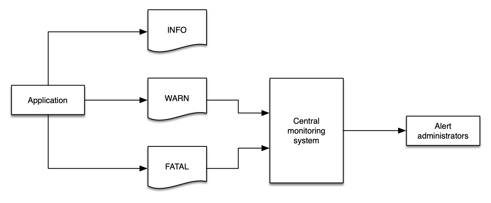

# ログ

ログは、アプリケーションまたはアプライアンスから送信される一連のメッセージで、イベントの詳細や、そのアプリケーションの健全性に関する 1 行または複数行の情報で表されます。通常、ログはファイルに出力されますが、時にはログを収集し、分析と集約を行うコレクターに送信されることもあります。ログの生成、取り込み、管理を、1 日あたり数メガバイトから 1 時間あたり数テラバイトまでの任意の量で行うことを目的とした、多くの高機能なログ集約ツール、フレームワーク、製品があります。

ログは 1 つのアプリケーションから順次出力され、通常はその*1 つのアプリケーション*の範囲に関するものですが、開発者は複雑で微妙なログを自由に作成できます。ここでは、ログを [トレース](../signals/traces) とは根本的に異なるシグナルと考えています。トレースは複数のアプリケーションやサービスからのイベントで構成され、レスポンス待ち時間、サービス障害、リクエストパラメータなどのサービス間の接続に関する文脈が含まれています。

ログのデータは一定期間にわたって集約することもできます。例えば、統計的なデータ (前分の要求数など) になる場合があります。構造化、自由形式、冗長で、任意の書面言語で記述できます。

ログの主な使用例は次のとおりです。

* イベントの説明 (ステータス、期間、その他の重要な統計情報を含む)
* そのイベントに関するエラーや警告 (スタックトレース、タイムアウトなど)
* アプリケーションの起動、開始、終了メッセージ

note
    ログは*イミュータブル(不変)*であることが意図されており、多くのログ管理システムには、ログデータの変更を防ぐ、および変更の試みを検出するメカニズムが含まれています。

ログに関する要件にかかわらず、以下が私たちが特定したベストプラクティスです。

## 構造化されたログは成功の鍵

多くのシステムは半構造化された形式でログを出力します。例えば、Apache Webサーバーは次のように、1行ごとにWebリクエストに関する情報を出力します。

    192.168.2.20 - - [28/Jul/2006:10:27:10 -0300] "GET /cgi-bin/try/ HTTP/1.0" 200 3395
    127.0.0.1 - - [28/Jul/2006:10:22:04 -0300] "GET / HTTP/1.0" 200 2216

一方、Javaのスタックトレースは、複数行にわたる単一のイベントで、構造化されていません。

    Exception in thread "main" java.lang.NullPointerException
        at com.example.myproject.Book.getTitle(Book.java:16)
        at com.example.myproject.Author.getBookTitles(Author.java:25)
        at com.example.myproject.Bootstrap.main(Bootstrap.java:14)

また、Pythonのエラーログイベントは次のようになります。
```
	Traceback (most recent call last):
	  File "e.py", line 7, in <module>
	    raise TypeError("Again !?!")
	TypeError: Again !?!
```
これら3つの例のうち、最初の例のみが人間とログ集約システムの両方で簡単に解析できます。構造化されたログを使用すると、ログデータを迅速かつ効果的に処理でき、人間と機械の両方がすぐに必要なデータを見つけることができます。

最も一般的に理解されているログ形式はJSONで、各イベントの構成要素がキー/値のペアとして表されます。JSONでは、上記のPythonの例は次のように書き換えられます。
```
	{
		"level", "ERROR"
		"file": "e.py",
		"line": 7,
		"error": "TypeError(\"Again !?!\")"
	}
```
構造化されたログを使用すると、データをログシステム間で移植できるようになり、開発が簡素化され、オペレーショナルな診断が高速化されます(エラーも少なくなります)。また、JSONにはログメッセージのスキーマと実際のデータが埋め込まれているため、高度なログ分析システムがメッセージを自動的にインデックス化できます。
</module>

## ログレベルを適切に使用する

ログには、*レベル* を持つものと、一連のイベントであるものの 2 種類があります。レベルを持つログは、成功したログ戦略の重要な要素です。ログレベルは、フレームワークによってわずかに異なりますが、一般的にこの構造に従います。

| レベル | 説明 |
| ----- | ----------- |
| `DEBUG` | アプリケーションのデバッグに最も役立つ、細かい情報イベント。通常、開発者にとって価値があり、非常に詳細です。 |
| `INFO` | アプリケーションの進捗状況を大まかに示す情報メッセージ。 |
| `WARN` | アプリケーションにリスクがあることを示す、潜在的に有害な状況。これらはアプリケーションでアラームをトリガーする可能性があります。 |
| `ERROR` | アプリケーションが実行を続けられるかもしれないエラーイベント。これらは注意を要するアラームをトリガーする可能性があります。 |
| `FATAL` | おそらくアプリケーションを中止させる非常に深刻なエラーイベント。 |

info
	明示的なレベルが指定されていないログは、`INFO` と見なされる場合がありますが、この動作はアプリケーションによって異なります。

他の一般的なログレベルは、ニーズ、プログラミング言語、フレームワークによって `CRITICAL` と `NONE` です。`ALL` と `NONE` も一般的ですが、すべてのアプリケーションスタックで見られるわけではありません。

ログレベルは、環境の健全性についてモニタリングとオブザーバビリティソリューションに通知するのに重要です。ログデータは、論理的な値を使ってこのデータを簡単に表現できるはずです。

tip
	`WARN` で多すぎるデータをログに記録すると、モニタリングシステムが価値の限られたデータで一杯になり、膨大なメッセージの量で重要なデータを見失う可能性があります。



info
	標準化されたログレベル戦略を使用すると、自動化が容易になり、開発者が問題の根本原因をすばやく特定できるようになります。


warning
	ログレベルに標準的なアプローチがないと、[ソース付近でのログのフィルタリング](#filter-logs-close-to-the-source)が大きな課題になります。


## ソース近くでログをフィルタリングする

可能な限り、ソースに近い場所でログの量を減らすことが重要です。このベストプラクティスに従う理由は次のとおりです。

* ログの取り込みには常に時間、費用、リソースがかかります。
* 下流のシステムから機密データ (個人を特定できるデータなど) をフィルタリングすると、データ漏洩のリスクが軽減されます。
* 下流のシステムは、データソースと同じ運用上の懸念がない場合があります。たとえば、アプリケーションからの `INFO` ログは、`CRITICAL` や `FATAL` メッセージを監視する監視およびアラートシステムでは関心がない可能性があります。
* ログシステムやネットワークに過度の負荷やトラフィックがかからないようにする必要があります。

info
コストを抑え、データ漏洩のリスクを減らし、各コンポーネントを[重要なこと](../guides/#monitor-what-matters)に集中させるために、ソース近くでログをフィルタリングしてください。


tip
アーキテクチャによっては、アプリケーションと環境の変更を 1 つの操作で展開するために、インフラストラクチャ as コード (IaC) を使用することをお勧めします。このアプローチでは、アプリケーションと同じ厳格さと処理でログフィルターパターンを展開できます。


## 二重取り込みのアンチパターンを避ける

管理者が一般的に行うパターンは、すべてのログデータを単一のシステムにコピーし、単一の場所からすべてのログを照会できるようにすることです。このようにすることには、マニュアルワークフローの利点がありますが、このパターンでは追加のコスト、複雑さ、障害ポイント、運用オーバーヘッドが発生します。


info
可能な限り、[ログレベルの適切な使用](#use-log-levels-appropriately)と[ログのフィルタリング](#filter-logs-close-to-the-source)の組み合わせを使用して、環境からのログデータの一括伝播を避けてください。


info
一部の組織やワークロードでは、規制要件を満たす、ログを安全な場所に保存する、非改ざん性を提供する、または他の目的を達成するために[ログ転送](https://en.wikipedia.org/wiki/Log_shipping)が必要になる場合があります。これは、ログデータを再取り込みするための一般的なユースケースです。ただし、[ログレベルの適切な使用](#use-log-levels-appropriately)と[ログのフィルタリング](#filter-logs-close-to-the-source)を適切に行うことで、これらのログアーカイブに入る不要なデータの量を減らすことができます。


## ログからメトリクスデータを収集する

ログには、収集を待っている[メトリクス](../signals/metrics/)が含まれています! ISV ソリューションや自分で書いていないアプリケーションでも、ワークロードの全体的な健全性に関する有益な洞察を得られるデータをログに出力します。一般的な例は次のとおりです。

* データベースからのクエリ時間の遅延
* Web サーバーのアップタイム
* トランザクション処理時間
* 時間経過に伴う `ERROR` または `WARNING` イベントの数
* アップグレード可能なパッケージの生の数

tip
	このデータは静的なログファイルに閉じ込められていると役に立ちません。ベストプラクティスは、重要なメトリクスデータを特定し、他のシグナルと相関させることができるメトリクスシステムに公開することです。


## `stdout` にログを出力する

可能な場合、アプリケーションはファイルやソケットなどの固定された場所にログを出力するのではなく、`stdout` にログを出力する必要があります。これにより、ログエージェントがルールに基づいてログイベントを収集およびルーティングし、独自のオブザーバビリティソリューションに適したログ管理を行えるようになります。すべてのアプリケーションで可能というわけではありませんが、これはコンテナ化されたワークロードにおけるベストプラクティスです。

note
アプリケーションはログ出力の方法を一般的で単純なものにし、ログソリューションから疎結合にしておく必要があります。しかし、ログデータの送信には、`stdout` からデータをファイルに送信する[ログコレクター](../tools/logs/)が必要です。重要な概念は、アプリケーションとビジネスロジックがログインフラストラクチャに依存しないようにすることです。つまり、関心の分離を行う必要があります。


info
アプリケーションをログ管理から分離することで、コード変更なしにソリューションを適応・進化させることができ、環境への変更の[Blast Radius](../faq/#what-is-a-blast-radius)を最小限に抑えることができます。
