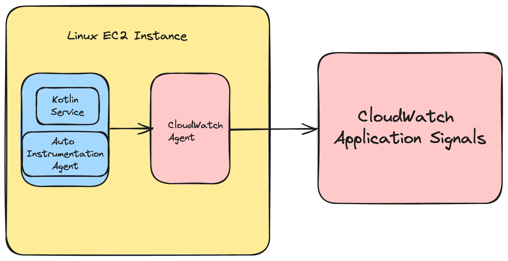
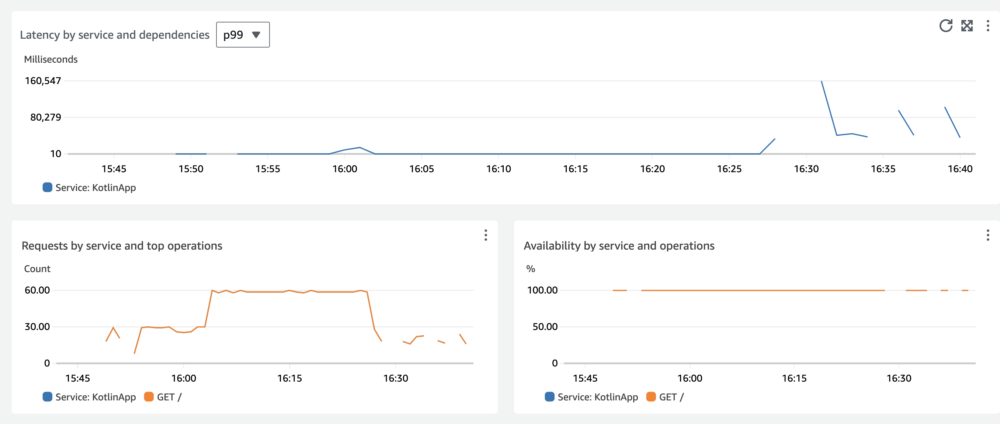

# Kotlin サービスのアプリケーションシグナル

## はじめに

Kotlin Web アプリケーションのパフォーマンスと正常性を監視することは、さまざまなコンポーネント間の複雑な相互作用があるため、難しい課題です。[Kotlin](https://kotlinlang.org/) Web サービスは通常、Java 環境で実行できる Java アーカイブ (jar) ファイルにビルドされます。これらのアプリケーションは、データベース、外部 API、キャッシュレイヤーなど、複数の相互接続されたコンポーネントを含む分散環境内で動作することが多くあります。この複雑さにより、平均復旧時間 (MTTR) が大幅に増加する可能性があります。

このガイドでは、Linux EC2 サーバー上で実行されている Kotlin Web サービスを自動的にインストルメント化する方法を示します。[CloudWatch Application Signals](https://docs.aws.amazon.com/ja_jp/AmazonCloudWatch/latest/monitoring/CloudWatch-Application-Monitoring-Sections.html) を有効にすると、[AWS Distro for OpenTelemetry](https://aws-otel.github.io/docs/introduction) (ADOT) Java 自動インストルメンテーション エージェントを使用してアプリケーションからテレメトリを収集できるようになり、コード変更なしでアプリケーションからメトリクスとトレースを収集できます。コールボリューム、可用性、レイテンシー、障害、エラーなどの主要なメトリクスを活用することで、アプリケーションサービスの現在の運用状況を迅速に確認してトリアージでき、長期的なパフォーマンスと事業目標を満たしているかどうかを検証できます。

## 前提条件

- CloudWatch Application Signals と対話するための適切な [IAM 権限](https://docs.aws.amazon.com/ja_jp/AmazonCloudWatch/latest/monitoring/Application_Signals_Permissions.html) を持つ Linux EC2 インスタンス。このガイドでは [Amazon Linux](https://aws.amazon.com/jp/linux/amazon-linux-2023/) インスタンスを利用しているため、他のディストリビューションを使用している場合はコマンドが若干異なる可能性があります。
- インスタンスに [SSH](https://docs.aws.amazon.com/ja_jp/AWSEC2/latest/UserGuide/connect-linux-inst-ssh.html) できる環境。

## ソリューションの概要

高レベルでは、以下の手順を実行します。

- CloudWatch Application Signals を有効にします。
- [ktor Web サービス](https://ktor.io/) を fat jar としてデプロイします。
- Web サービスから Application Signals を受信するように CloudWatch エージェントを設定してインストールします。
- [ADOT](https://aws-otel.github.io/docs/getting-started/java-sdk/auto-instr#introduction) 自動インストルメンテーション エージェントをダウンロードします。
- サービスを自動的にインストルメントするために、Kotlin サービスの jar と Java エージェントを併せて実行します。
- テレメトリを生成するためにいくつかのテストを実行します。

### アーキテクチャ図



### CloudWatch Application Signals を有効化する

アカウントで、手順 1: [Application Signals を有効化する](https://docs.aws.amazon.com/ja_jp/AmazonCloudWatch/latest/monitoring/CloudWatch-Application-Signals-Enable-EC2.html) の指示に従ってください。

### Ktor Web サービスをデプロイする
[Ktor](https://ktor.io/) は、Web サービスを作成するための人気のある Kotlin フレームワークです。非同期のサーバーサイドアプリケーションを素早く開始できます。

作業ディレクトリを作成します。
```
mkdir kotlin-signals && cd kotlin-signals
```

Ktor の例リポジトリをクローンします。
```
git clone https://github.com/ktorio/ktor-samples.git && cd ktor-samples/structured-logging
```

アプリケーションをビルドします。
```
./gradlew build && cd build/libs
```

アプリケーションが実行できることを確認します。
```
java -jar structured-logging-all.jar
```

サービスが正しくビルドされ実行された場合は、`ctrl + c` で停止できます。

### CloudWatch エージェントの設定
Amazon Linux インスタンスには、デフォルトで CloudWatch エージェントがインストールされています。インスタンスにインストールされていない場合は、[インストール](https://docs.aws.amazon.com/ja_jp/AmazonCloudWatch/latest/monitoring/install-CloudWatch-Agent-on-EC2-Instance.html)する必要があります。

インストール後、設定ファイルを作成できます。
```
sudo nano /opt/aws/amazon-cloudwatch-agent/bin/app-signals-config.json
```

次の設定をファイルにコピー&ペーストします。
```
{
    "traces": {
        "traces_collected": {
            "app_signals": {}
        }
    },
    "logs": {
        "metrics_collected": {
            "app_signals": {}
        }
    }
}
```

ファイルを保存し、作成した設定で CloudWatch エージェントを起動します。
```
sudo /opt/aws/amazon-cloudwatch-agent/bin/amazon-cloudwatch-agent-ctl -a fetch-config -m ec2 -s -c file:/opt/aws/amazon-cloudwatch-agent/bin/app-signals-config.json
```

### ADOT 自動インストルメンテーション Agent をダウンロードする

jar ファイルを含むディレクトリに移動し、このデモを簡単にするためにここにエージェントを配置します。実際のシナリオでは、おそらく独自のフォルダに配置されるでしょう。

```
cd kotlin-signals/ktor-samples/structured-logging/build/libs
```

自動インストルメンテーション Agent をダウンロードします。
```
wget https://github.com/aws-observability/aws-otel-java-instrumentation/releases/latest/download/aws-opentelemetry-agent.jar
```

### ADOT エージェントを使用して Ktor サービスを実行する
```
OTEL_RESOURCE_ATTRIBUTES=service.name=KotlinApp,service.namespace=MyKotlinService,aws.hostedin.environment=EC2 \
OTEL_AWS_APPLICATION_SIGNALS_ENABLED=true \
OTEL_AWS_APPLICATION_SIGNALS_EXPORTER_ENDPOINT=http://localhost:4316/v1/metrics \
OTEL_EXPORTER_OTLP_PROTOCOL=http/protobuf \
OTEL_EXPORTER_OTLP_TRACES_ENDPOINT=http://localhost:4316/v1/traces \
OTEL_METRICS_EXPORTER=none \
OTEL_LOGS_EXPORT=none \
java -javaagent:aws-opentelemetry-agent.jar -jar structured-logging-all.jar
```

### サービスにトラフィックを生成してテレメトリを作成する
```
for i in {1..1800}; do curl http://localhost:8080 && sleep 2; done
```

## テレメトリを確認する

CloudWatch の 'Services' セクションに Kotlin サービスが表示されるはずです。


'Service Map' にもサービスが表示されます。


この計装により、レイテンシーなどの貴重なメトリクスが提供されます。



### 次のステップ

次のステップとして、[Application Signals Experience](https://docs.aws.amazon.com/ja_jp/AmazonCloudWatch/latest/monitoring/CloudWatch-Application-Monitoring-Sections.html) をさらに探索し、サービスの [SLO](https://docs.aws.amazon.com/ja_jp/AmazonCloudWatch/latest/monitoring/CloudWatch-ServiceLevelObjectives.html) を作成することをおすすめします。また、Ktor で kotlin マイクロサービスをさらに作成し、より複雑なバックエンドを構築することも良い次のステップです。分散型の複雑な環境では、Application Signals のようなツールの恩恵がもっとも大きくなります。

### クリーンアップ

EC2 インスタンスを終了し、`/aws/appsignals/generic` ロググループを削除してください。
