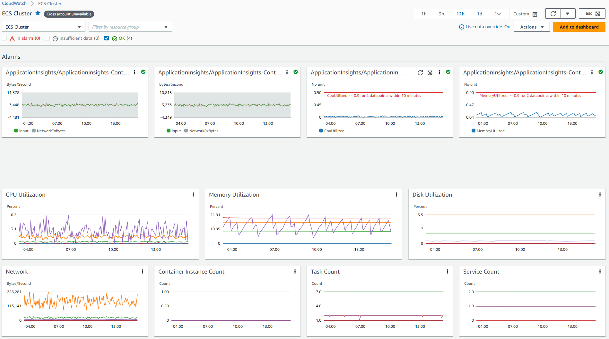
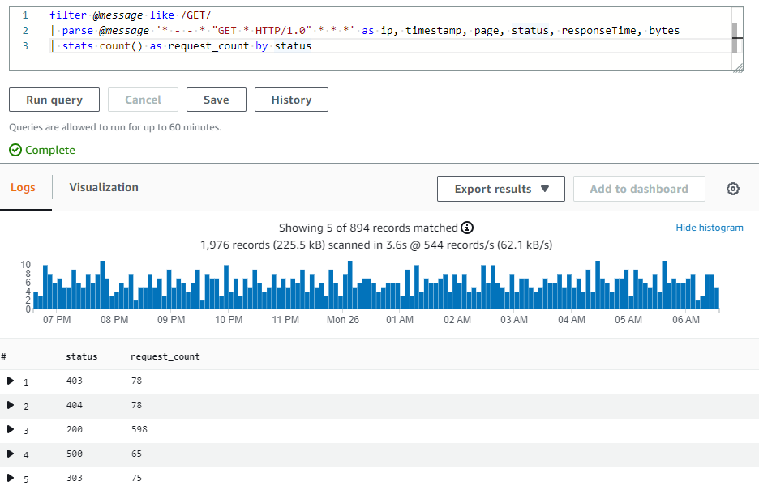

# CloudWatch ダッシュボード


## はじめに

AWS アカウント内のリソースの在庫詳細、リソースのパフォーマンス、ヘルスチェックを把握することは、安定したリソース管理にとって重要です。Amazon CloudWatch ダッシュボードは、CloudWatch コンソールでカスタマイズ可能なホームページであり、クロスアカウントや異なるリージョンに分散していても、リソースを単一のビューで監視するために使用できます。

[Amazon CloudWatch ダッシュボード](https://docs.aws.amazon.com/ja_jp/AmazonCloudWatch/latest/monitoring/CloudWatch_Dashboards.html) を使用すると、お客様は再利用可能なグラフを作成し、クラウドリソースとアプリケーションを統合されたビューで可視化できます。CloudWatch ダッシュボードを通じて、お客様はメトリクスとログデータを並べて統合ビューでグラフ化し、素早くコンテキストを把握し、問題の診断から根本原因の理解へと移行できます。これにより、平均復旧時間または解決時間 (MTTR) を短縮できます。例えば、お客様は CPU 使用率やメモリなどの主要なメトリクスの現在の使用状況を可視化し、割り当てられた容量と比較できます。また、特定のメトリクスのログパターンを相関させ、パフォーマンスや運用上の問題についてアラームを設定することもできます。CloudWatch ダッシュボードは、アラームの現在のステータスを表示し、お客様が素早く可視化し、アクションのために注意を引くことにも役立ちます。CloudWatch ダッシュボードの共有により、お客様は表示されたダッシュボード情報を、組織内外のチームや関係者と簡単に共有できます。


## ウィジェット


#### デフォルトのウィジェット

ウィジェットは CloudWatch ダッシュボードの構成要素であり、AWS 環境内のリソースやアプリケーションのメトリクス、ログに関する重要な情報とほぼリアルタイムの詳細を表示します。お客様は要件に応じてウィジェットの追加、削除、再配置、サイズ変更を行い、ダッシュボードを希望の表示にカスタマイズできます。

ダッシュボードに追加できるグラフの種類には、折れ線グラフ、数値、ゲージ、積み上げ面グラフ、棒グラフ、円グラフがあります。

デフォルトのウィジェットタイプには、**グラフ** タイプの **折れ線グラフ、数値、ゲージ、積み上げ面グラフ、棒グラフ、円グラフ** があります。また、**テキスト、アラームステータス、ログテーブル、エクスプローラー** などの他のウィジェットも用意されており、お客様はメトリクスやログデータを追加してダッシュボードを構築する際に選択できます。


**追加の参考資料：**

- AWS Observability Workshop の [Metric Number Widgets](https://catalog.workshops.aws/observability/en-US/aws-native/dashboards/metrics-number)
- AWS Observability Workshop の [Text Widgets](https://catalog.workshops.aws/observability/en-US/aws-native/dashboards/text-widget)
- AWS Observability Workshop の [Alarm Widgets](https://catalog.workshops.aws/observability/en-US/aws-native/dashboards/alarm-widgets)
- [CloudWatch ダッシュボードでのウィジェットの作成と操作](https://docs.aws.amazon.com/ja_jp/AmazonCloudWatch/latest/monitoring/create-and-work-with-widgets.html) に関するドキュメント


#### カスタムウィジェット

お客様は、CloudWatch ダッシュボードに[カスタムウィジェットを追加](https://docs.aws.amazon.com/ja_jp/AmazonCloudWatch/latest/monitoring/create-and-work-with-widgets.html)することもできます。これにより、カスタムビジュアライゼーションを体験したり、複数のソースからの情報を表示したり、ボタンなどのカスタムコントロールを追加して CloudWatch ダッシュボード上で直接アクションを実行したりすることができます。カスタムウィジェットは完全にサーバーレスで、Lambda 関数によって動作し、コンテンツ、レイアウト、インタラクションを完全に制御できます。カスタムウィジェットは、複雑な Web フレームワークを学ぶ必要なく、ダッシュボード上にカスタムデータビューやツールを構築する簡単な方法です。Lambda でコードを書き、HTML を作成できれば、有用なカスタムウィジェットを作成できます。


**追加の参考資料：**

- [カスタムウィジェット](https://catalog.workshops.aws/observability/en-US/aws-native/dashboards/custom-widgets)に関する AWS Observability ワークショップ
- GitHub 上の [CloudWatch カスタムウィジェットのサンプル](https://github.com/aws-samples/cloudwatch-custom-widgets-samples#what-are-custom-widgets)
- ブログ：[Amazon CloudWatch ダッシュボードのカスタムウィジェットの使用](https://aws.amazon.com/blogs/mt/introducing-amazon-cloudwatch-dashboards-custom-widgets/)


## 自動ダッシュボード

自動ダッシュボードは、すべての AWS パブリックリージョンで利用可能で、Amazon CloudWatch 下のすべての AWS リソースの健全性とパフォーマンスの集約ビューを提供します。
これにより、お客様はモニタリングをすぐに開始でき、メトリクスとアラームのリソースベースのビューを得られ、パフォーマンスの問題の根本原因を容易に掘り下げて理解することができます。

自動ダッシュボードは AWS サービスが推奨する[ベストプラクティス](https://docs.aws.amazon.com/ja_jp/prescriptive-guidance/latest/implementing-logging-monitoring-cloudwatch/cloudwatch-dashboards-visualizations.html)に基づいて事前に構築されており、リソースを認識し、重要なパフォーマンスメトリクスの最新の状態を反映するよう動的に更新されます。

自動サービスダッシュボードは、サービスの標準的な CloudWatch メトリクスをすべて表示し、各サービスメトリクスに使用されるすべてのリソースをグラフ化し、アカウント全体で異常なリソースを素早く特定するのに役立ちます。
これにより、利用率の高いリソースや低いリソースを特定し、コストの最適化に役立てることができます。


**追加の参考資料：**

- AWS Observability Workshop の [自動ダッシュボード](https://catalog.workshops.aws/observability/en-US/aws-native/dashboards/autogen-dashboard)
- YouTube の [Amazon CloudWatch ダッシュボードを使用した AWS リソースのモニタリング](https://www.youtube.com/watch?v=I7EFLChc07M)


#### 自動ダッシュボードにおける Container Insights

[CloudWatch Container Insights](https://docs.aws.amazon.com/ja_jp/AmazonCloudWatch/latest/monitoring/ContainerInsights.html) は、コンテナ化されたアプリケーションとマイクロサービスからメトリクスとログを収集、集約、要約します。Container Insights は、Amazon Elastic Container Service (Amazon ECS)、Amazon Elastic Kubernetes Service (Amazon EKS)、および Amazon EC2 上の Kubernetes プラットフォームで利用できます。Container Insights は、Amazon ECS と Amazon EKS の両方で Fargate にデプロイされたクラスターからのメトリクス収集をサポートしています。CloudWatch は、CPU、メモリ、ディスク、ネットワークなど多くのリソースのメトリクスを自動的に収集し、また、コンテナの再起動失敗などの診断情報を提供して、問題の分離と迅速な解決を支援します。

CloudWatch は、[埋め込みメトリクスフォーマット](https://aws-observability.github.io/observability-best-practices/guides/signal-collection/emf/) を使用して、クラスター、ノード、Pod、タスク、サービスレベルで集約されたメトリクスを CloudWatch メトリクスとして作成します。これは、高カーディナリティデータを大規模に取り込み、保存できる構造化された JSON スキーマを使用するパフォーマンスログイベントです。Container Insights が収集するメトリクスは、[CloudWatch 自動ダッシュボード](https://docs.aws.amazon.com/ja_jp/prescriptive-guidance/latest/implementing-logging-monitoring-cloudwatch/cloudwatch-dashboards-visualizations.html) で利用でき、CloudWatch コンソールの Metrics セクションでも表示できます。




#### 自動ダッシュボードにおける Lambda Insights

[CloudWatch Lambda Insights](https://docs.aws.amazon.com/ja_jp/lambda/latest/dg/monitoring-insights.html) は、AWS Lambda などのサーバーレスアプリケーション向けのモニタリングおよびトラブルシューティングソリューションで、Lambda 関数用の動的な[自動ダッシュボード](https://docs.aws.amazon.com/ja_jp/prescriptive-guidance/latest/implementing-logging-monitoring-cloudwatch/cloudwatch-dashboards-visualizations.html)を作成します。また、CPU 時間、メモリ、ディスク、ネットワークなどのシステムレベルのメトリクスや、コールドスタートや Lambda ワーカーのシャットダウンなどの診断情報を収集、集約、要約し、Lambda 関数の問題を分離して迅速に解決するのに役立ちます。[Lambda Insights](https://docs.aws.amazon.com/ja_jp/AmazonCloudWatch/latest/monitoring/Lambda-Insights.html) は、関数レベルでレイヤーとして提供される Lambda 拡張機能で、有効にすると[埋め込みメトリクスフォーマット](https://aws-observability.github.io/observability-best-practices/guides/signal-collection/emf/)を使用してログイベントからメトリクスを抽出し、エージェントを必要としません。


## カスタムダッシュボード

お客様は、[カスタムダッシュボード](https://docs.aws.amazon.com/ja_jp/AmazonCloudWatch/latest/monitoring/create_dashboard.html) を必要な数だけ作成し、異なるウィジェットを使用して適切にカスタマイズすることができます。ダッシュボードはリージョン間およびアカウント間のビューに設定でき、お気に入りリストに追加することができます。


お客様は、自動またはカスタムダッシュボードを CloudWatch コンソールの [お気に入りリスト](https://docs.aws.amazon.com/ja_jp/AmazonCloudWatch/latest/monitoring/add-dashboard-to-favorites.html) に追加することで、コンソールページのナビゲーションペインから素早く簡単にアクセスできるようになります。

**追加の参考資料：**

- [CloudWatch ダッシュボード](https://catalog.workshops.aws/observability/en-US/aws-native/dashboards/create) に関する AWS Observability ワークショップ
- [CloudWatch ダッシュボードを使用したモニタリング](https://www.wellarchitectedlabs.com/performance-efficiency/100_labs/100_monitoring_windows_ec2_cloudwatch/) に関する AWS Well-Architected Labs のパフォーマンス効率


#### CloudWatch ダッシュボードへの Contributor Insights の追加

CloudWatch は [Contributor Insights](https://docs.aws.amazon.com/ja_jp/AmazonCloudWatch/latest/monitoring/ContributorInsights.html) を提供しており、ログデータを分析して貢献者データを表示する時系列を作成します。これにより、上位 N 人の貢献者に関するメトリクス、ユニークな貢献者の総数、およびその使用状況を確認できます。これは、トップトーカーを見つけ、誰が、または何がシステムパフォーマンスに影響を与えているかを理解するのに役立ちます。例えば、顧客は問題のあるホストを見つけたり、最も重いネットワークユーザーを特定したり、最もエラーを生成する URL を見つけたりすることができます。

Contributor Insights レポートは、CloudWatch コンソールの [新規または既存のダッシュボード](https://docs.aws.amazon.com/ja_jp/AmazonCloudWatch/latest/monitoring/ContributorInsights-ViewReports.html) に追加できます。


#### CloudWatch ダッシュボードへの Application Insights の追加

[CloudWatch Application Insights](https://docs.aws.amazon.com/ja_jp/AmazonCloudWatch/latest/monitoring/cloudwatch-application-insights.html) は、AWS でホストされているアプリケーションとその基盤となる AWS リソースのオブザーバビリティを容易にします。
これにより、アプリケーションの健全性の可視性が向上し、アプリケーションの問題をトラブルシューティングするための平均修復時間 (MTTR) の短縮に役立ちます。
Application Insights は、監視対象のアプリケーションの潜在的な問題を示す自動化されたダッシュボードを提供し、お客様がアプリケーションとインフラストラクチャの進行中の問題を迅速に特定するのに役立ちます。

以下に示すように、Application Insights 内の「CloudWatch にエクスポート」オプションは、CloudWatch コンソールにダッシュボードを追加します。
これにより、お客様は重要なアプリケーションを簡単に監視し、インサイトを得ることができます。


#### CloudWatch ダッシュボードへのサービスマップの追加

[CloudWatch ServiceLens](https://docs.aws.amazon.com/ja_jp/AmazonCloudWatch/latest/monitoring/ServiceLens.html) は、トレース、メトリクス、ログ、アラーム、およびその他のリソースの健全性情報を一箇所に統合することで、サービスとアプリケーションのオブザーバビリティを向上させます。
ServiceLens は CloudWatch と AWS X-Ray を統合し、アプリケーションのエンドツーエンドのビューを提供することで、お客様がパフォーマンスのボトルネックを効率的に特定し、影響を受けるユーザーを識別するのに役立ちます。
[サービスマップ](https://docs.aws.amazon.com/ja_jp/AmazonCloudWatch/latest/monitoring/servicelens_service_map.html) は、サービスエンドポイントとリソースをノードとして表示し、各ノードとその接続のトラフィック、レイテンシー、エラーを強調表示します。
表示される各ノードは、サービスのその部分に関連する相関メトリクス、ログ、トレースについての詳細な洞察を提供します。

以下に示すように、サービスマップ内の「ダッシュボードに追加」オプションは、CloudWatch コンソールに新しいダッシュボードを追加するか、既存のダッシュボードに追加します。
これにより、お客様は洞察を得るためにアプリケーションを簡単にトレースできます。


#### CloudWatch ダッシュボードへの Metrics Explorer の追加

CloudWatch の [Metrics Explorer](https://docs.aws.amazon.com/ja_jp/AmazonCloudWatch/latest/monitoring/CloudWatch-Metrics-Explorer.html) は、タグベースのツールで、お客様が AWS サービスのオブザーバビリティを向上させるために、タグやリソースプロパティでメトリクスをフィルタリング、集約、可視化することができます。Metrics Explorer は柔軟でダイナミックなトラブルシューティング体験を提供し、お客様は一度に複数のグラフを作成し、これらのグラフを使用してアプリケーションの健全性ダッシュボードを構築できます。Metrics Explorer の可視化はダイナミックであるため、Metrics Explorer ウィジェットを作成して CloudWatch ダッシュボードに追加した後に一致するリソースが作成された場合、新しいリソースは自動的に Explorer ウィジェットに表示されます。

以下に示すように、Metrics Explorer 内の「[ダッシュボードに追加](https://docs.aws.amazon.com/ja_jp/AmazonCloudWatch/latest/monitoring/add_metrics_explorer_dashboard.html)」オプションを使用すると、CloudWatch コンソールで新しいダッシュボードを作成したり、既存のダッシュボードに追加したりできます。これにより、お客様は AWS サービスとリソースについてより多くのグラフインサイトを簡単に得ることができます。


## CloudWatch ダッシュボードで可視化するもの

お客様は、アカウントレベルとアプリケーションレベルでダッシュボードを作成し、リージョンやアカウントをまたいでワークロードとアプリケーションを監視できます。CloudWatch の自動ダッシュボードを使用すれば、すぐに始めることができます。これは AWS サービスレベルのダッシュボードで、サービス固有のメトリクスがあらかじめ設定されています。本番環境のアプリケーションやワークロードに関連し、重要なメトリクスとリソースに焦点を当てた、アプリケーションおよびワークロード固有のダッシュボードを作成することをお勧めします。


#### メトリクスデータの可視化

メトリクスデータは、CloudWatch ダッシュボードに **線グラフ、数値、ゲージ、積み上げ面グラフ、棒グラフ、円グラフ** などのグラフウィジェットを通じて追加できます。これらは **平均、最小、最大、合計、サンプル数** などのメトリクスに対する統計によってサポートされています。[統計](https://docs.aws.amazon.com/ja_jp/AmazonCloudWatch/latest/monitoring/Statistics-definitions.html) は、指定された期間にわたるメトリクスデータの集計です。


[Metric Math](https://docs.aws.amazon.com/ja_jp/AmazonCloudWatch/latest/monitoring/using-metric-math.html) を使用すると、複数の CloudWatch メトリクスを照会し、これらのメトリクスに基づいて数学的表現を使用して新しい時系列を作成できます。お客様は、結果として得られた時系列を CloudWatch コンソールで可視化し、ダッシュボードに追加できます。また、[GetMetricDataAPI](https://docs.aws.amazon.com/ja_jp/AmazonCloudWatch/latest/APIReference/API_GetMetricData.html) 操作を使用してプログラムで Metric Math を実行することもできます。

**追加参考資料：**

- [CloudWatch を使用した IoT フリートの監視](https://aws.amazon.com/blogs/iot/monitoring-your-iot-fleet-using-cloudwatch/)


#### ログデータの可視化

お客様は、CloudWatch ダッシュボードで[ログデータの可視化](https://docs.aws.amazon.com/ja_jp/AmazonCloudWatch/latest/logs/CWL_Insights-Visualizing-Log-Data.html)を実現できます。棒グラフ、折れ線グラフ、積み上げ面グラフを使用して、パターンをより効率的に識別できます。CloudWatch Logs Insights は、stats 関数と 1 つ以上の集計関数を使用するクエリに対して、棒グラフを生成できる可視化を生成します。クエリが bin() 関数を使用して時間経過とともに 1 つのフィールドで[データをグループ化](https://docs.aws.amazon.com/ja_jp/AmazonCloudWatch/latest/logs/CWL_Insights-Visualizing-Log-Data.html)する場合、折れ線グラフと積み上げ面グラフを可視化に使用できます。

[時系列データ](https://docs.aws.amazon.com/ja_jp/AmazonCloudWatch/latest/logs/CWL_Insights-Visualizing-Log-Data.html)は、クエリに 1 つ以上のステータス関数の集計が含まれている場合、またはクエリが bin() 関数を使用して 1 つのフィールドでデータをグループ化する場合、その特性を使用して可視化できます。

stats 関数として count() を使用したサンプルクエリを以下に示します。

```java
filter @message like /GET/
| parse @message '_ - - _ "GET _ HTTP/1.0" .*.*.*' as ip, timestamp, page, status, responseTime, bytes
| stats count() as request_count by status
```

上記のクエリに対する結果は、CloudWatch Logs Insights で以下のように表示されます。



クエリ結果の円グラフによる可視化を以下に示します。


**追加参考資料：**

- CloudWatch ダッシュボードで[ログ結果を表示する](https://catalog.workshops.aws/observability/en-US/aws-native/logs/logsinsights/displayformats)方法に関する AWS Observability ワークショップ。
- [Amazon CloudWatch ダッシュボードを使用して AWS WAF ログを可視化する](https://aws.amazon.com/blogs/security/visualize-aws-waf-logs-with-an-amazon-cloudwatch-dashboard/)


#### アラームの可視化

CloudWatch のメトリクスアラームは、単一のメトリクスまたは CloudWatch メトリクスに基づく数式の結果を監視します。アラームは、一定期間にわたるしきい値に対するメトリクスまたは式の値に基づいて、1 つ以上のアクションを実行します。[CloudWatch ダッシュボード](https://docs.aws.amazon.com/ja_jp/AmazonCloudWatch/latest/monitoring/add_remove_alarm_dashboard.html) には、単一のアラームをウィジェットとして追加できます。これにより、アラームのメトリクスのグラフとアラームのステータスが表示されます。また、CloudWatch ダッシュボードにアラームステータスウィジェットを追加することで、複数のアラームのステータスをグリッド形式で表示できます。このウィジェットでは、アラーム名と現在のステータスのみが表示され、グラフは表示されません。

CloudWatch ダッシュボード内のアラームウィジェットに表示されたメトリクスアラームステータスのサンプルを以下に示します。


## クロスアカウント & クロスリージョン

複数の AWS アカウントを持つお客様は、[CloudWatch クロスアカウント](https://docs.aws.amazon.com/ja_jp/AmazonCloudWatch/latest/monitoring/cloudwatch_crossaccount_dashboard.html) オブザーバビリティを設定し、中央モニタリングアカウントに豊富なクロスアカウントダッシュボードを作成できます。
これにより、アカウントの境界を越えてメトリクス、ログ、トレースをシームレスに検索、可視化、分析することができます。

お客様は、[クロスアカウント クロスリージョン](https://docs.aws.amazon.com/ja_jp/AmazonCloudWatch/latest/monitoring/cloudwatch_xaxr_dashboard.html) ダッシュボードも作成できます。
これは、複数の AWS アカウントと複数のリージョンからの CloudWatch データを 1 つのダッシュボードにまとめたものです。
このハイレベルなダッシュボードから、お客様はアプリケーション全体の統合ビューを得ることができ、アカウントのサインイン・サインアウトやリージョンの切り替えをすることなく、より具体的なダッシュボードにドリルダウンすることもできます。

**追加の参考資料：**

- [新しいクロスアカウントの Amazon EC2 インスタンスを中央の Amazon CloudWatch ダッシュボードに自動追加する方法](https://aws.amazon.com/blogs/mt/how-to-auto-add-new-cross-account-amazon-ec2-instances-in-a-central-amazon-cloudwatch-dashboard/)
- [マルチアカウント Amazon CloudWatch ダッシュボードのデプロイ](https://aws.amazon.com/blogs/mt/deploy-multi-account-amazon-cloudwatch-dashboards/)
- YouTube の [クロスアカウント & クロスリージョン CloudWatch ダッシュボードの作成](https://www.youtube.com/watch?v=eIUZdaqColg)


## ダッシュボードの共有

CloudWatch ダッシュボードは、チーム間の人々、ステークホルダー、そして AWS アカウントに直接アクセスできない組織外の人々と共有することができます。これらの[共有ダッシュボード](https://docs.aws.amazon.com/ja_jp/AmazonCloudWatch/latest/monitoring/cloudwatch-dashboard-sharing.html)は、チームエリア、モニタリングやネットワークオペレーションセンター (NOC) の大画面に表示したり、Wiki や公開 Web ページに埋め込んだりすることもできます。

簡単かつ安全に共有するための 3 つの方法があります。

- ダッシュボードを[公開共有](https://docs.aws.amazon.com/ja_jp/AmazonCloudWatch/latest/monitoring/cloudwatch-dashboard-sharing.html)して、リンクを持つ誰もがダッシュボードを閲覧できるようにする。
- ダッシュボードを閲覧できる人の[特定のメールアドレスに共有](https://docs.aws.amazon.com/ja_jp/AmazonCloudWatch/latest/monitoring/cloudwatch-dashboard-sharing.html)する。これらのユーザーはそれぞれ、ダッシュボードを閲覧するために入力する独自のパスワードを作成します。
- [シングルサインオン (SSO) プロバイダー](https://docs.aws.amazon.com/ja_jp/AmazonCloudWatch/latest/monitoring/cloudwatch-dashboard-sharing.html)を通じてアクセスする AWS アカウント内でダッシュボードを共有する。

**ダッシュボードを公開共有する際の注意点**

ダッシュボードに機密情報や秘密情報が含まれている場合、CloudWatch ダッシュボードの公開共有はお勧めできません。可能な限り、ダッシュボードを共有する際にはユーザー名/パスワードまたはシングルサインオン (SSO) による認証を利用することをお勧めします。

ダッシュボードを公開アクセス可能にすると、CloudWatch はダッシュボードをホストする Web ページへのリンクを生成します。Web ページを閲覧する人は誰でも、公開共有されたダッシュボードの内容を見ることができます。Web ページは、共有するダッシュボード内のアラームとコントリビューターインサイトルールを照会するための API を呼び出すための一時的な認証情報を、リンクを通じて提供します。また、共有するダッシュボードに表示されていない場合でも、アカウント内のすべてのメトリクスと、すべての EC2 インスタンスの名前とタグにアクセスできます。この情報を公開することが適切かどうかを検討することをお勧めします。

ダッシュボードを Web ページに公開共有を有効にすると、以下の Amazon Cognito リソースがアカウントに作成されることに注意してください：Cognito ユーザープール、Cognito アプリクライアント、Cognito ID プール、IAM ロール。

**認証情報を使用してダッシュボードを共有する際の注意点（ユーザー名とパスワードで保護されたダッシュボード）**

ダッシュボードに、共有するユーザーと共有したくない機密情報や秘密情報が含まれている場合、CloudWatch ダッシュボードの共有はお勧めできません。

ダッシュボードの共有を有効にすると、CloudWatch はダッシュボードをホストする Web ページへのリンクを生成します。上記で指定したユーザーには以下の権限が付与されます：共有するダッシュボード内のアラームとコントリビューターインサイトルールに対する CloudWatch の読み取り専用権限、およびアカウント内のすべてのメトリクスと、ダッシュボードに表示されていない場合でもすべての EC2 インスタンスの名前とタグへのアクセス権限。この情報を共有するユーザーに提供することが適切かどうかを検討することをお勧めします。

Web ページへのアクセスを指定したユーザーのためにダッシュボードの共有を有効にすると、以下の Amazon Cognito リソースがアカウントに作成されることに注意してください：Cognito ユーザープール、Cognito ユーザー、Cognito アプリクライアント、Cognito ID プール、IAM ロール。

**SSO プロバイダーを使用してダッシュボードを共有する際の注意点**

CloudWatch ダッシュボードをシングルサインオン (SSO) を使用して共有する場合、選択した SSO プロバイダーに登録されているユーザーには、共有されているアカウント内のすべてのダッシュボードにアクセスする権限が付与されます。また、この方法でダッシュボードの共有を無効にすると、すべてのダッシュボードが自動的に共有解除されます。

**追加の参考資料：**

- [ダッシュボードの共有](https://catalog.workshops.aws/observability/en-US/aws-native/dashboards/sharingdashboard)に関する AWS Observability ワークショップ
- ブログ：[AWS シングルサインオンを使用して Amazon CloudWatch ダッシュボードを誰とでも共有する](https://aws.amazon.com/jp/blogs/news/share-your-amazon-cloudwatch-dashboards-with-anyone-using-aws-single-sign-on/)
- ブログ：[Amazon CloudWatch ダッシュボードを共有してモニタリング情報を伝達する](https://aws.amazon.com/blogs/mt/communicate-monitoring-information-by-sharing-amazon-cloudwatch-dashboards/)


## ライブデータ

CloudWatch ダッシュボードは、ワークロードからのメトリクスが常に公開されている場合、メトリクスウィジェットを通じて[ライブデータ](https://docs.aws.amazon.com/ja_jp/AmazonCloudWatch/latest/monitoring/cloudwatch-live-data.html)も表示します。
お客様は、ダッシュボード全体、またはダッシュボード上の個々のウィジェットに対してライブデータを有効にするかどうかを選択できます。

ライブデータが**オフ**の場合、過去 1 分以上の集計期間を持つデータポイントのみが表示されます。
例えば、5 分間隔を使用する場合、12:35 のデータポイントは 12:35 から 12:40 まで集計され、12:41 に表示されます。

ライブデータが**オン**の場合、対応する集計間隔内でデータが公開されるとすぐに、最新のデータポイントが表示されます。
表示を更新するたびに、その集計期間内に新しいデータが公開されると、最新のデータポイントが変更される可能性があります。


## アニメーション化されたダッシュボード

[アニメーション化されたダッシュボード](https://docs.aws.amazon.com/ja_jp/AmazonCloudWatch/latest/monitoring/cloudwatch-animated-dashboard.html) は、時間の経過とともに収集された CloudWatch メトリクスデータを再生します。これにより、お客様はトレンドを確認したり、プレゼンテーションを行ったり、問題発生後に分析したりすることができます。ダッシュボード内のアニメーション化されたウィジェットには、折れ線グラフ、積み上げ面グラフ、数値ウィジェット、メトリクスエクスプローラーウィジェットが含まれます。円グラフ、棒グラフ、テキストウィジェット、ログウィジェットはダッシュボードに表示されますが、アニメーション化されません。


## CloudWatch ダッシュボードの API/CLI サポート

AWS マネジメントコンソールを通じて CloudWatch ダッシュボードにアクセスする以外に、お客様は API、AWS コマンドラインインターフェイス (CLI)、AWS SDK を通じてもサービスにアクセスできます。ダッシュボード用の CloudWatch API は、AWS CLI を通じた自動化やソフトウェア/製品との統合を支援し、リソースやアプリケーションの管理や運用にかける時間を削減できます。

- [ListDashboards](https://docs.aws.amazon.com/ja_jp/AmazonCloudWatch/latest/APIReference/API_ListDashboards.html)：アカウントのダッシュボード一覧を返します
- [GetDashboard](https://docs.aws.amazon.com/ja_jp/AmazonCloudWatch/latest/APIReference/API_GetDashboard.html)：指定したダッシュボードの詳細を表示します
- [DeleteDashboards](https://docs.aws.amazon.com/ja_jp/AmazonCloudWatch/latest/APIReference/API_DeleteDashboards.html)：指定したすべてのダッシュボードを削除します
- [PutDashboard](https://docs.aws.amazon.com/ja_jp/AmazonCloudWatch/latest/APIReference/API_PutDashboard.html)：ダッシュボードが存在しない場合は作成し、既存のダッシュボードを更新します。ダッシュボードを更新する場合、内容全体がここで指定したものに置き換えられます

CloudWatch API リファレンスの [ダッシュボードボディ構造と構文](https://docs.aws.amazon.com/ja_jp/AmazonCloudWatch/latest/APIReference/CloudWatch-Dashboard-Body-Structure.html)

AWS コマンドラインインターフェイス (AWS CLI) は、コマンドラインシェルでコマンドを使用して AWS サービスと対話できるオープンソースツールです。ブラウザベースの AWS マネジメントコンソールが提供する機能と同等の機能を、ターミナルプログラムのコマンドプロンプトから実装します。

CLI サポート：

- [list-dashboards](https://docs.aws.amazon.com/ja_jp/cli/latest/reference/cloudwatch/list-dashboards.html)
- [get-dashboard](https://docs.aws.amazon.com/ja_jp/cli/latest/reference/cloudwatch/get-dashboard.html)
- [delete-dashboards](https://docs.aws.amazon.com/ja_jp/cli/latest/reference/cloudwatch/delete-dashboards.html)
- [put-dashboard](https://docs.aws.amazon.com/ja_jp/cli/latest/reference/cloudwatch/put-dashboard.html)

**追加参考資料：** [CloudWatch ダッシュボードと AWS CLI](https://catalog.workshops.aws/observability/en-US/aws-native/dashboards/createcli) に関する AWS Observability ワークショップ


## CloudWatch ダッシュボードの自動化

CloudWatch ダッシュボードの作成を自動化するために、お客様は CloudFormation や Terraform などの Infrastructure as Code (IaC) ツールを使用できます。これらのツールは AWS リソースのセットアップを支援し、お客様がリソースの管理に費やす時間を減らし、AWS 上で実行されるアプリケーションに集中できるようにします。

[AWS CloudFormation](https://docs.aws.amazon.com/ja_jp/AWSCloudFormation/latest/UserGuide/aws-resource-cloudwatch-dashboard.html) はテンプレートを通じてダッシュボードの作成をサポートしています。AWS::CloudWatch::Dashboard リソースは Amazon CloudWatch ダッシュボードを指定します。

[Terraform](https://registry.terraform.io/providers/hashicorp/aws/latest/docs/resources/cloudwatch_dashboard) も IaC 自動化を通じて CloudWatch ダッシュボードの作成をサポートするモジュールを持っています。

必要なウィジェットを使用してダッシュボードを手動で作成することは簡単です。しかし、コンテンツが Auto Scaling グループのスケールアウトやスケールインイベント中に作成または削除される EC2 インスタンスなどの動的な情報に基づいている場合、リソースソースを更新するには多少の労力が必要になる場合があります。Amazon EventBridge と AWS Lambda を使用して [Amazon CloudWatch ダッシュボードを自動的に作成および更新する](https://aws.amazon.com/blogs/mt/update-your-amazon-cloudwatch-dashboards-automatically-using-amazon-eventbridge-and-aws-lambda/) 方法については、ブログ記事を参照してください。

**追加の参考ブログ：**

- [Amazon EBS ボリューム KPI 用の Amazon CloudWatch ダッシュボード作成の自動化](https://aws.amazon.com/blogs/storage/automating-amazon-cloudwatch-dashboard-creation-for-amazon-ebs-volume-kpis/)
- [AWS Systems Manager と Ansible を使用した Amazon CloudWatch アラームとダッシュボードの作成の自動化](https://aws.amazon.com/blogs/mt/automate-creation-of-amazon-cloudwatch-alarms-and-dashboards-with-aws-systems-manager-and-ansible/)
- [AWS CDK を使用した AWS Outposts 用の自動化された Amazon CloudWatch ダッシュボードのデプロイ](https://aws.amazon.com/blogs/compute/deploying-an-automated-amazon-cloudwatch-dashboard-for-aws-outposts-using-aws-cdk/)

[CloudWatch ダッシュボード](https://aws.amazon.com/jp/cloudwatch/faqs/) に関する **製品 FAQ**
