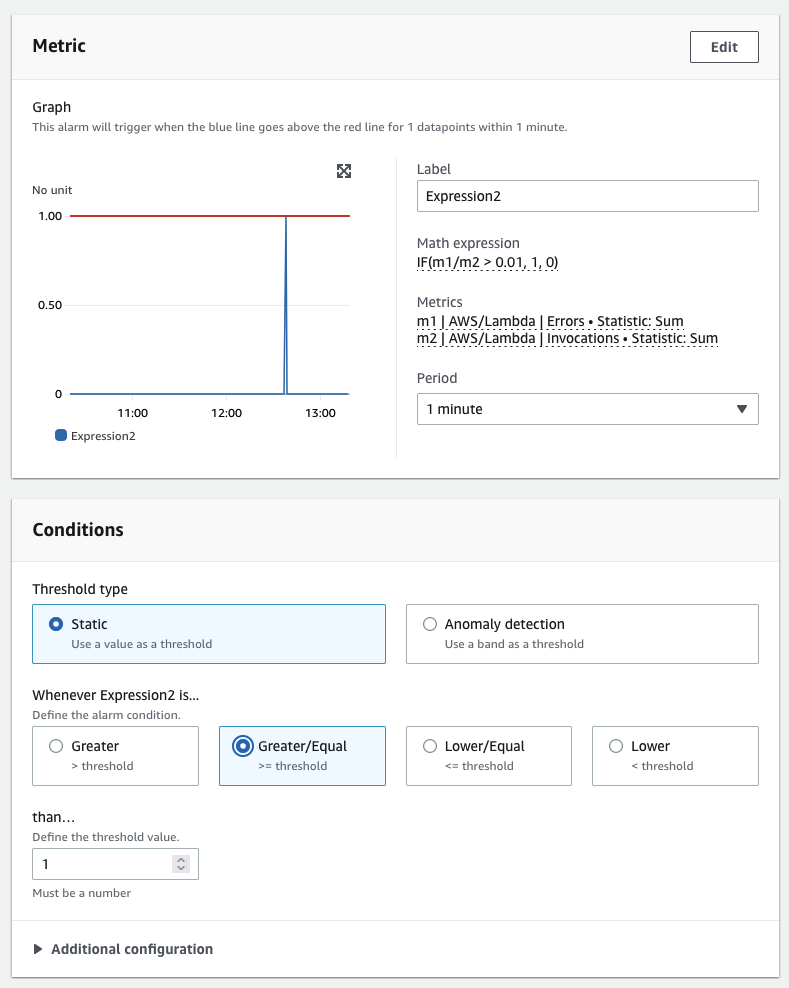
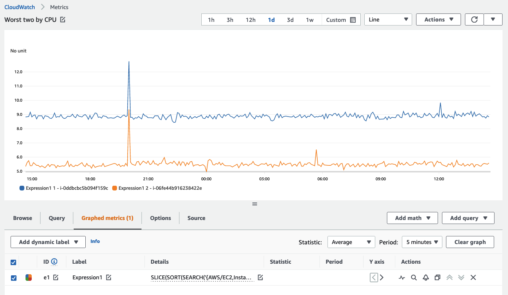

# メトリクス

メトリクスは、システムのパフォーマンスに関するデータです。システムまたはリソースに関連するすべてのメトリクスを集中管理できれば、メトリクスを比較し、パフォーマンスを分析し、リソースのスケールアップやスケールダウンなどの戦略的な意思決定を行うことができます。メトリクスは、リソースの健全性を把握し、積極的な対策を講じるためにも重要です。

メトリクスデータは基盤となるものであり、[アラーム](../signals/alarms/)、異常検知、[イベント](../signals/events/)、[ダッシュボード](../tools/dashboards)などを駆動するために使用されます。

## ベンダーメトリクス

[CloudWatch メトリクス](https://docs.aws.amazon.com/ja_jp/AmazonCloudWatch/latest/monitoring/working_with_metrics.html)は、システムのパフォーマンスに関するデータを収集します。デフォルトでは、ほとんどの AWS サービスがリソースの無料メトリクスを提供しています。これには [Amazon EC2](https://aws.amazon.com/jp/ec2/) インスタンス、[Amazon RDS](https://aws.amazon.com/jp/rds/)、[Amazon S3](https://aws.amazon.com/jp/s3/) バケットなどが含まれます。

これらのメトリクスを *ベンダーメトリクス* と呼びます。AWS アカウントでベンダーメトリクスを収集するための料金はかかりません。

info
	CloudWatch にメトリクスを送信する AWS サービスの完全なリストは、[このページ](https://docs.aws.amazon.com/ja_jp/AmazonCloudWatch/latest/monitoring/aws-services-cloudwatch-metrics.html)を参照してください。


## メトリクスのクエリ

CloudWatch の [Metric Math](https://docs.aws.amazon.com/ja_jp/AmazonCloudWatch/latest/monitoring/using-metric-math.html) 機能を利用して、複数のメトリクスをクエリし、メトリクスを分析するための数式を使用できます。たとえば、次のようなメトリック数式を書いて、Lambda のエラー率を求めることができます。

    Errors/Requests

以下は、CloudWatch コンソールでこれがどのように表示されるかの例です。


info
    Metric Math を使用して、データから最大限の価値を引き出し、個別のデータソースのパフォーマンスから値を導出できます。

CloudWatch は条件式もサポートしています。たとえば、レイテンシが特定のしきい値を超える時系列には `1` を、それ以外のデータポイントには `0` を返すクエリは次のようになります。

    IF(latency>threshold, 1, 0)

CloudWatch コンソールでは、この論理を使ってブール値を作成でき、その結果 [CloudWatch アラーム](../tools/alarms) やその他のアクションをトリガーできます。これにより、導出されたデータポイントから自動的にアクションを実行できます。CloudWatch コンソールの例を以下に示します。



info
    条件式を使用して、導出された値のパフォーマンスがしきい値を超えたときにアラームや通知をトリガーできます。

また、`SEARCH` 関数を使用して、任意のメトリクスの上位 `n` 件を表示できます。大量の時系列 (例: 数千台のサーバー) にわたる最良または最悪のパフォーマンスメトリクスを可視化する際、このアプローチを使用すると、最も重要なデータのみを表示できます。以下は、過去 5 分間の平均で CPU 使用率が最も高い上位 2 つの EC2 インスタンスを返すクエリの例です。

```
	SLICE(SORT(SEARCH('{AWS/EC2,InstanceId} MetricName="CPUUtilization"', 'Average', 300), MAX, DESC),0, 2)
```
そして、CloudWatch コンソールでの表示例は次のとおりです。



info
    `SEARCH` アプローチを使用して、環境内の価値のある、または最悪のパフォーマンスのリソースを迅速に表示し、それらを [ダッシュボード](../tools/dashboards) に表示できます。


## メトリクスの収集

EC2 インスタンスのメモリやディスク使用量などの追加メトリクスが必要な場合は、[CloudWatch エージェント](../tools/cloudwatch_agent/)を使用して、代わりにこのデータを CloudWatch にプッシュできます。または、グラフィカルな方法で可視化する必要がある独自の処理データがあり、このデータを CloudWatch メトリクスとして表示したい場合は、[`PutMetricData` API](https://docs.aws.amazon.com/ja_jp/AmazonCloudWatch/latest/APIReference/API_PutMetricData.html) を使用してカスタムメトリクスを CloudWatch に公開できます。

info
	メトリクスデータを CloudWatch にプッシュするには、ベア API ではなく [AWS SDK](https://aws.amazon.com/jp/developer/tools/) のいずれかを使用してください。

`PutMetricData` API 呼び出しは、クエリの数に応じて課金されます。`PutMetricData` API を最適に使用するためのベストプラクティスは、この API の Values と Counts メソッドを使用することです。これにより、1 つの `PutMetricData` リクエストで最大 150 個の値をメトリクスに公開でき、このデータの百分位数統計を取得できます。したがって、各データポイントに対して個別の API 呼び出しを行うのではなく、すべてのデータポイントをグループ化してから、単一の `PutMetricData` API 呼び出しで CloudWatch にプッシュする必要があります。このアプローチには、ユーザーに対して 2 つの利点があります。

1. CloudWatch の価格設定
2. `PutMetricData` API のスロットリングを防ぐ

info
	`PutMetricData` を使用する場合、可能な限りデータを単一の `PUT` 操作にバッチ処理することがベストプラクティスです。

info
	大量のメトリクスが CloudWatch に出力される場合は、代替アプローチとして [Embedded Metric Format](https://docs.aws.amazon.com/ja_jp/AmazonCloudWatch/latest/monitoring/CloudWatch_Embedded_Metric_Format_Manual.html) の使用を検討してください。Embedded Metric Format では `PutMetricData` は使用されず、課金もされませんが、[CloudWatch Logs](../tools/logs/) の使用に応じて課金されることに注意してください。


## 異常検知

CloudWatch には、記録されたメトリクスに基づいて *正常* とは何かを学習し、オブザーバビリティ戦略を補完する[異常検知](https://docs.aws.amazon.com/ja_jp/AmazonCloudWatch/latest/monitoring/CloudWatch_Anomaly_Detection.html)機能があります。メトリクスシグナル収集システムにおいて、異常検知を使用することは[ベストプラクティス](../signals/metrics/#use-anomaly-detection-algorithms)です。

異常検知は 2 週間の期間でモデルを構築します。

warning
	異常検知は作成時点から先のみモデルを構築します。過去の異常値を見つけるために時間を遡ることはありません。


warning
	異常検知はメトリクスにとって *良い* 値が何かを知りません。標準偏差に基づいて *正常* な値が何かのみを知っています。


info
	ベストプラクティスは、正常な動作が予想される時間帯のみを分析するように異常検知モデルを訓練することです。訓練から除外する時間帯 (夜間、週末、休日など) を定義できます。


異常検知バンドの例がここにあり、グレーの帯がバンドです。


CloudWatch コンソール、[CloudFormation](https://docs.aws.amazon.com/ja_jp/AWSCloudFormation/latest/UserGuide/aws-properties-cloudwatch-anomalydetector-configuration.html)、または AWS SDK のいずれかを使用して、異常検知の除外ウィンドウを設定できます。
