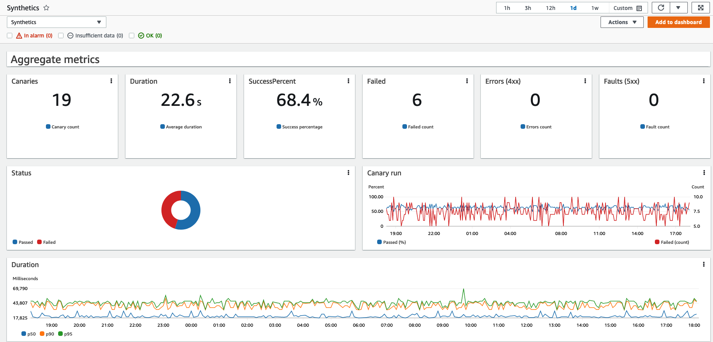
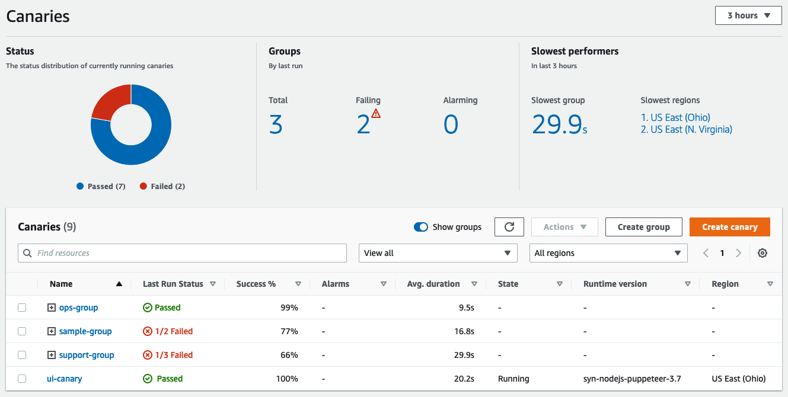

# 合成テスト

Amazon CloudWatch Synthetics を使用すると、実際のユーザーがいない場合でも、顧客の視点からアプリケーションを監視できます。API とウェブサイトのエクスペリエンスを継続的にテストすることで、ユーザートラフィックがない場合でも発生する断続的な問題の可視性を得ることができます。

Canary は設定可能なスクリプトで、スケジュールに従って実行し、API とウェブサイトのエクスペリエンスを 24 時間 365 日継続的にテストできます。実際のユーザーと同じコードパスとネットワークルートをたどり、レイテンシー、ページ読み込みエラー、リンク切れ、ユーザーワークフローの破損など、予期しない動作を通知できます。

:::note
    Synthetics Canary を使用して監視するのは、所有権や権限を持つエンドポイントと API のみにしてください。Canary の頻度設定によっては、これらのエンドポイントのトラフィックが増加する可能性があります。
:::

## はじめに

### 完全なカバレッジ

:::tip
    テスト戦略を開発する際は、Amazon VPC 内のパブリックエンドポイントと [プライベート内部エンドポイント](https://aws.amazon.com/blogs/mt/monitor-your-private-endpoints-using-cloudwatch-synthetics/) の両方を考慮してください。
:::

### 新しい Canary の記録

[CloudWatch Synthetics Recorder](https://chrome.google.com/webstore/detail/cloudwatch-synthetics-rec/bhdnlmmgiplmbcdmkkdfplenecpegfno) Chrome ブラウザプラグインを使用すると、複雑なワークフローを持つ新しい Canary テストスクリプトをゼロから素早く構築できます。記録中に行われたタイプとクリックのアクションは、Canary の作成に使用できる Node.js スクリプトに変換されます。CloudWatch Synthetics Recorder の既知の制限事項は、[このページ](https://docs.aws.amazon.com/ja_jp/AmazonCloudWatch/latest/monitoring/CloudWatch_Synthetics_Canaries_Recorder.html) に記載されています。

### 集計メトリクスの表示

Canary スクリプトのフリートから収集された集計メトリクスに関する、すぐに使える報告機能を活用しましょう。CloudWatch 自動ダッシュボード

## Canary の構築

### ブループリント

[Canary ブループリント](https://docs.aws.amazon.com/ja_jp/AmazonCloudWatch/latest/monitoring/CloudWatch_Synthetics_Canaries_Blueprints.html) を使用して、複数の Canary タイプのセットアッププロセスを簡素化します。

:::info
    ブループリントは Canary を書き始めるのに便利な方法で、シンプルなユースケースではコードを書かずに対応できます。
:::

### 保守性

独自の Canary を作成する場合、それらは *ランタイムバージョン* に紐づけられます。これは、Selenium を使用した Python の特定のバージョン、または Puppeteer を使用した JavaScript の特定のバージョンになります。現在サポートされているランタイムバージョンと非推奨のバージョンのリストについては、[このページ] を参照してください。

:::info
    Canary の実行中にアクセスできるデータを共有するために [環境変数を使用する](https://aws.amazon.com/blogs/mt/using-environment-variables-with-amazon-cloudwatch-synthetics/) ことで、スクリプトの保守性を向上させることができます。
:::

:::info
    利用可能な場合は、Canary を最新のランタイムバージョンにアップグレードしてください。
:::

### 文字列シークレット

Canary をコーディングして、シークレット（ログイン認証情報など）を Canary 外部や環境変数以外の安全なシステムから取得することができます。AWS Lambda がアクセスできるシステムであれば、実行時に Canary にシークレットを提供することが可能です。

:::info
    AWS Secrets Manager を使用してデータベース接続の詳細、API キー、アプリケーション認証情報などのシークレットを保存することで、テストを実行し、[機密データを安全に保護](https://aws.amazon.com/blogs/mt/secure-monitoring-of-user-workflow-experience-using-amazon-cloudwatch-synthetics-and-aws-secrets-manager/)することができます。
:::

## 大規模な Canary の管理

### リンク切れの確認
:::info
    ウェブサイトに大量の動的コンテンツやリンクが含まれている場合、CloudWatch Synthetics を使用してウェブサイトをクロールし、[リンク切れを検出](https://aws.amazon.com/blogs/mt/cloudwatch-synthetics-to-find-broken-links-on-your-website/)し、失敗の理由を見つけることができます。その後、失敗しきい値を使用して、しきい値違反が発生した場合に CloudWatch アラームを作成することもできます。
:::

### 複数のハートビート URL

:::info
    [複数の URL をバッチ処理](https://aws.amazon.com/blogs/mt/simplify-your-canary-by-batching-multiple-urls-in-amazon-cloudwatch-synthetics/) することで、テストを簡素化し、コストを最適化できます。これにより、単一のハートビート監視 Canary テストで複数の URL を監視できます。Canary 実行レポートのステップサマリーで、各 URL のステータス、所要時間、関連するスクリーンショット、および失敗理由を確認できます。
:::

### グループで整理する

:::info
    [グループ](https://docs.aws.amazon.com/ja_jp/AmazonCloudWatch/latest/monitoring/CloudWatch_Synthetics_Groups.html) で Canary を整理し追跡することで、集計されたメトリクスを表示し、障害をより簡単に分離して詳しく調査することができます。
:::

:::warning
    クロスリージョングループを作成する場合、グループには Canary の正確な名前が必要であることに注意してください。
:::

## ランタイムオプション

### バージョンとサポート

CloudWatch Synthetics は現在、スクリプトに Node.js を使用し、フレームワークに [Puppeteer](https://github.com/puppeteer/puppeteer) を使用するランタイムと、スクリプトに Python を使用し、フレームワークに [Selenium WebDriver](https://www.selenium.dev/documentation/webdriver/) を使用するランタイムをサポートしています。

:::info
    Synthetics ライブラリの最新の機能と更新を使用できるように、Canary には常に最新のランタイムバージョンを使用してください。
:::

CloudWatch Synthetics は、今後 60 日以内に[廃止予定のランタイム](https://docs.aws.amazon.com/ja_jp/AmazonCloudWatch/latest/monitoring/CloudWatch_Synthetics_Canaries_Library.html)を使用している Canary がある場合、メールで通知します。

### コードサンプル

[Node.js と Puppeteer](https://docs.aws.amazon.com/ja_jp/AmazonCloudWatch/latest/monitoring/CloudWatch_Synthetics_Canaries_Samples.html) および [Python と Selenium](https://docs.aws.amazon.com/ja_jp/AmazonCloudWatch/latest/monitoring/CloudWatch_Synthetics_Canaries_Samples.html) のコードサンプルで始めましょう。

### Selenium のインポート

[Python と Selenium](https://aws.amazon.com/blogs/mt/create-canaries-in-python-and-selenium-using-amazon-cloudwatch-synthetics/) を使用して、Canary をゼロから作成するか、既存のスクリプトを最小限の変更でインポートして作成します。
