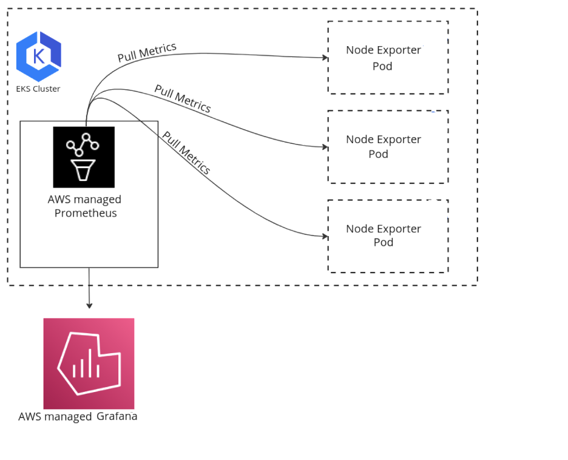

# EKS Monitoring with AWS Open source service
<!-- Workloads with Node Exporter, Amazon Managed Prometheus, and Grafana Visualization
-->
In the world of containerized applications and Kubernetes, monitoring and observability are crucial for ensuring the reliability, performance, and efficiency of your workloads. Amazon Elastic Kubernetes Service (EKS) provides a powerful and scalable platform for deploying and managing containerized applications, and when combined with tools like Node Exporter, Amazon Managed Prometheus, and Grafana, you can unlock a comprehensive monitoring solution for your EKS workloads.

Node Exporter is a Prometheus exporter that exposes a wide range of hardware and kernel-related metrics from a host machine. By deploying Node Exporter as a DaemonSet in your EKS cluster, you can collect valuable metrics from each worker node, including CPU, memory, disk, and network usage, as well as various system-level metrics.

Amazon Managed Prometheus is a fully-managed service provided by AWS that simplifies the deployment, management, and scaling of Prometheus monitoring infrastructure. By integrating Node Exporter with Amazon Managed Prometheus, you can collect and store node-level metrics in a highly available and scalable manner, without the overhead of managing and scaling Prometheus instances yourself.

Grafana is a powerful open-source data visualization and monitoring tool that seamlessly integrates with Prometheus. By configuring Grafana to connect to your Amazon Managed Prometheus instance, you can create rich and customizable dashboards that provide real-time insights into the health and performance of your EKS workloads and underlying infrastructure.

*Figure 1: EKS node metrics sent to AMP and visualize with AMG*

Deploying this monitoring stack in your EKS cluster offers several benefits:

1. Comprehensive Visibility: By collecting metrics from Node Exporter and visualizing them in Grafana, you gain end-to-end visibility into your EKS workloads, from the application level down to the underlying infrastructure, enabling you to proactively identify and address issues.

2. Scalability and Reliability: Amazon Managed Prometheus and Grafana are designed to be highly scalable and reliable, ensuring that your monitoring solution can grow seamlessly as your EKS workloads scale, without compromising performance or availability.

3. Centralized Monitoring: With Amazon Managed Prometheus acting as a centralized monitoring platform, you can consolidate metrics from multiple EKS clusters, enabling you to monitor and compare workloads across different environments or regions.

4. Custom Dashboards and Alerts: Grafana's powerful dashboard and alerting capabilities allow you to create custom visualizations tailored to your specific monitoring needs, enabling you to surface relevant metrics and set up alerts for critical events or thresholds.

5. Integration with AWS Services: Amazon Managed Prometheus seamlessly integrates with other AWS services, such as Amazon CloudWatch and AWS X-Ray, enabling you to correlate and visualize metrics from various sources within a unified monitoring solution.

To implement this monitoring stack in your EKS cluster, you'll need to follow these general steps:

1. Deploy Node Exporter as a DaemonSet on your EKS worker nodes to collect node-level metrics.
2. Set up an Amazon Managed Prometheus workspace and configure it to scrape metrics from Node Exporter.
3. Install and configure Grafana, either within your EKS cluster or as a separate service, and connect it to your Amazon Managed Prometheus workspace.
4. Create custom Grafana dashboards and configure alerts based on your monitoring requirements.

While this monitoring solution provides powerful capabilities, it's important to consider the potential overhead and resource consumption introduced by Node Exporter, Prometheus, and Grafana. Careful planning and resource allocation are necessary to ensure that your monitoring components do not compete with your application workloads for resources.

Additionally, you should ensure that your monitoring solution adheres to best practices for data security, access control, and retention policies. Implementing secure communication channels, authentication mechanisms, and data encryption is crucial to maintain the confidentiality and integrity of your monitoring data.

In conclusion, deploying Node Exporter, Amazon Managed Prometheus, and Grafana in your EKS cluster provides a comprehensive monitoring solution for your containerized workloads. By leveraging these tools, you can gain deep insights into the performance and health of your applications, enabling proactive issue detection, efficient resource utilization, and informed decision-making. However, it's essential to carefully plan and implement this monitoring stack, considering resource consumption, security, and compliance requirements to ensure an effective and robust monitoring solution for your EKS workloads.