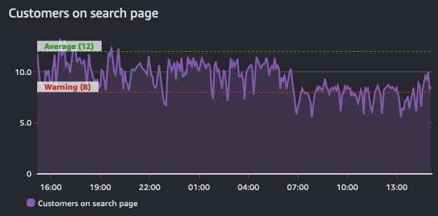

# Alarms

An alarm refers to the state of a probe, monitor, or change in a value over or under a given threshold. A simple example would be an alarm that sends an email when a disk is full or a web site is down. More sophisticated alarms are entirely programmatic and used to drive complex interactions such as auto-scaling or creating of entire server clusters. 

Regardless of the use case though, an alarm indicates the current *state* of a metric. This state can be `OK`, `WARNING`, `ALERT`, or `NO DATA`, depending on the system in question. 

Alarms reflect this state for a period of time and are built on top of a timeseries. As such, they are derived *from* a time series. This graph below shows two alarms: one with a warning threshold, and another that is indicative of average values across this timeseries. As the volume of traffic in this shows, the alarms for the warning threshold should be in a breach state when it dips below the defined value.

:::info
	The purpose of an alarm can be either to trigger an action (either human or progammatic), or to be informational (that a threshold is breached). Alarms provide insight into performance of a metric.
:::
## Alert on things that are actionable

Alarm fatigue is when people get so many alerts that they have learned to ignore them. This is not an indication of a well-monitored system! Rather this is an anti-pattern.

:::info
	Create alarms for things that are actionable, and you should always work from your [objectives](../guides/#monitor-what-matters) backwards.
:::

For example, if you operate a web site that requires fast response times, create an alert to be delivered when your response times are exceeding a given threshold. And if you have identified that poor performance is tied to high CPU utilization then alert on this datapoint *proactively* before it becomes an issue. However, there may no need to alert on all CPU utilization *everywhere* in your environment if it does not *endanger your outcomes*.

:::info
	If an alarm does not need alert you, or trigger an automated process, then there is no need to have it alert you. You should remove the notifications from alarms that are superfluous. 
:::

## Beware of the "everything is OK alarm"

Likewise, a common pattern is the "everything is OK" alarm, when operators are so used to getting constant alerts that they only notice when things suddenly go silent! This is a very dangerous mode to operate in, and a pattern that works against [operational excellence](../faq/#what-is-operational-excellence).

:::warning
	The "everything is OK alarm" usually requries a human to interpret it! This makes patterns like self-healing applications impossible.[^1]
:::
## Fight alarm fatigue with aggregation

Observability is a *human* problem, not a technology problem. And as such, your alarm strategy should focus on reducing alarms rather than creating more. As you implement  telemetry collection, it is natural to have more alerts from your environment. Be cautious though to only [alert on things that are actionable](../signals/alarms/#alert-on-things-that-are-actionable). If the condition that caused the alert is not actionable then there is no need to report on it.

This is best shown by example: if you have five web servers that use a single database for their backend, what happens to your web servers if the database is down? The answer for many people is that they get *at least six* alerts - *five* for the web servers and *one* for the database! 

But there are only two alerts that make sense to deliver:

1. The web site is down, and
1. The database is the cause

:::info
	Distilling your alerts into aggregates makes it easier for people to understand, and then easier to create runbooks and automation for.
:::
## Use your existing ITSM and support processes

Regardless of your monitoring and observability platform, they must integrate into your current toolchain. 

:::info
	Create trouble tickets and issues using a programmatic integration from your alerts into these tools, removing human effort and streamlining processes along the way. 
:::
This allows you to derive important operatonal data such as [DORA metrics](https://en.wikipedia.org/wiki/DevOps).

[^1]: See https://aws.amazon.com/blogs/apn/building-self-healing-infrastructure-as-code-with-dynatrace-aws-lambda-and-aws-service-catalog/ for more about this pattern.