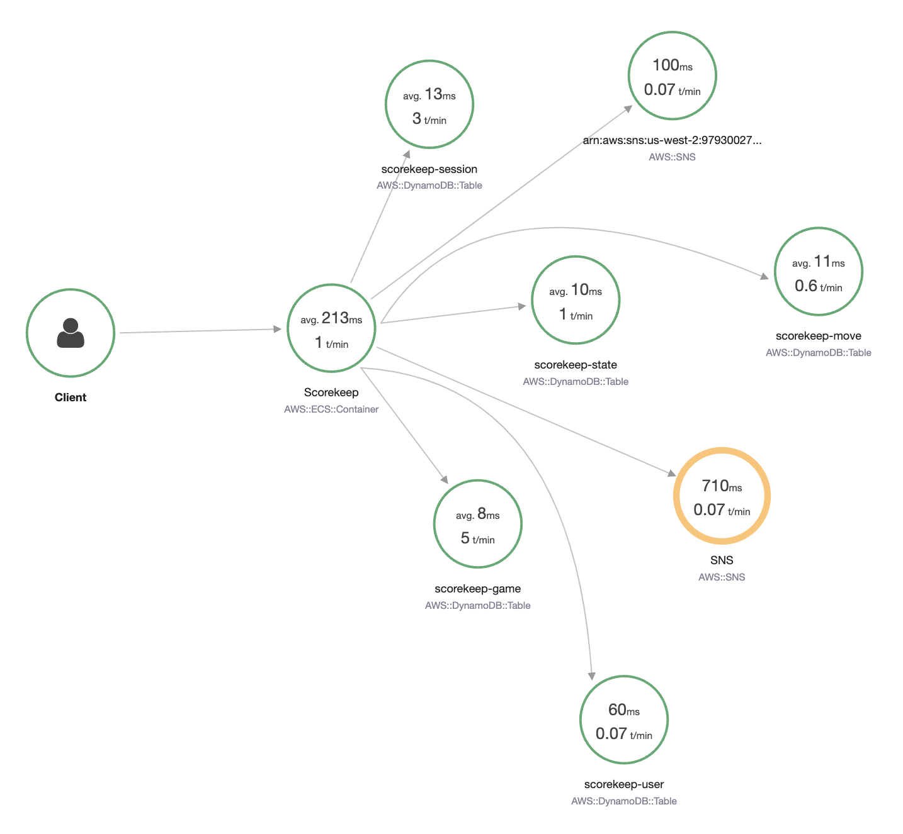

# Traces

Traces represent an entire journey of the requests as they traverse through different components of an application.

Unlike logs or metrics, *traces* are composed of events from more than one application or a service, and with context about the connection between services such as response latency, service faults, request parameters, and metadata.

:::tip
    There is conceptual similarity between [logs](../signals/logs/) and traces, however a trace is intended to be considered in a cross-service context, whereas logs are typically limited to the execution of a single service or application.
::::::tip
Today's developers are leaning towards building modular and distributed applications. Some call these [Service Oriented Architecture](https://en.wikipedia.org/wiki/Service-oriented_architecture), others will refer to them as [microservices](https://aws.amazon.com/microservices/). Regardless of the name, when something goes wrong in these loosely coupled applications, just looking at logs or events may not be sufficient to track down the root cause of an incident.  Having full visibility into request flow is essential and this is where traces add value. Through a series of causally related events that depict end-to-end request flow, traces help  you gain that visibility.

Traces are an essential pillar of observability because they provide the basic information on the flow of the request as it comes and leaves the system.

:::tip
    Common use cases for traces include performance profiling, debugging production issues, and root cause analysis of failures.
:::
## Instrument all of your integration points

When all of your workload functionality and code is at one place, it is easy to look at the source code to see how a request is passed across different functions. At a system level you know which machine the app is running and if something goes wrong, you can find the root cause quickly. Imagine doing that in a microservices-based architecture where different components are loosely coupled and are running in an distributed environment. Logging into numerous systems to see their logs from each interconnected request would be impractical, if not impossible.

This is where observability can help. Instrumentation is a key step towards increasing that observability. In broader terms Instrumentation is measuring the events in your application using code.

A typical instrumentation approach would be to assign a unique trace identifier for each request entering the system and carry that trace id as it passes through different components while adding additional metadata.

:::info
    Every connection from one service to another should be instrumented to emit traces to a central collector. This approach helps you see into otherwise opaque aspects of your workload.
:::
:::info
    Instrumenting your application can be a largely automated process when using an auto-instrumentation agent or library.
:::

## Transaction time and status matters, so measure it!

A well instrumented application can produce end to end trace, which can be viewed aseither a waterfall graph like this:

Or a service map:

It is important that you measure the transaction times and response codes to every interaction. This will help in calculating the overall processing times and track it for compliance with your SLAs, SLOs, or business KPIs.

:::info
    Only by understanding and recording the response times and status codes of your interactions can you see the contributing factors overall request patterns and workload health.
:::
## Metadata, annotations, and labels are your best friend

Traces are persisted and assigned a unique ID, with each trace broken down into *spans* or *segments* (depending on your tooling) that record each step within the request’s path. A span indicates the entities with which the trace interacts, and, like the parent trace, each span is assigned a unique ID and time stamp and can include additional data and metadata as well. This information is useful for debugging because it gives you the exact time and location a problem occurred.

This is best explained through a practical example. An e-commerce application may be divided into many domains: authentication, authorization, shipping, inventory, payment processing, fulfillment, product search, recommendations, and many more. Rather than search through traces from all of these interconnected domains though, labelling your trace with a customer ID allows you to search for only interactions that are specific to this one person. This helps you to narrow your search instantly when diagnosing an operational issue.

:::info
    While the naming convention may vary between vendors, each trace can be augmented with metadata, labels, or annotations, and these are searchable across your entire workload. Adding them does require code on your part, but greatly increases the observability of your workload.
:::
:::warning
    Traces are not logs, so be frugal with what metadata you include in your traces. And trace data is not intended for forensics and auditing, even with a high sample rate.
:::