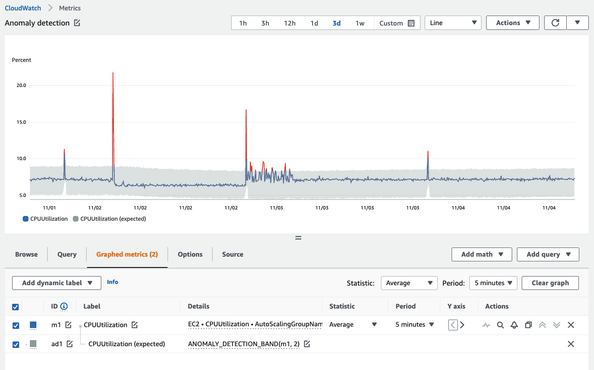

# Metrics

Metrics are data about the performance of your system. Having all the metrics related to system or the resources available in a centralised place grants you the ability to compare metrics, analyse performance, and make better strategic decisions like scaling-up or scaling-in resources. Metrics are also important for the knowing the health of the resources and take proactive measures.

Metric data is foundational and used to drive [alarms](../signals/alarms/), anomaly detection, [events](../signals/events/), [dashboards](../tools/dashboards) and more.

## Vended metrics

[CloudWatch metrics](https://docs.aws.amazon.com/AmazonCloudWatch/latest/monitoring/working_with_metrics.html) collects data about the performance of your systems. By default, most AWS services provide free metrics for their resources. This includes  [Amazon EC2](https://aws.amazon.com/ec2/) instances, [Amazon RDS](https://aws.amazon.com/rds/), [Amazon S3](https://aws.amazon.com/s3/?p=pm&c=s3&z=4) buckets, and many more. 

We refer to these metrics as *vended metrics*. There is no charge for the collection of vended metrics in your AWS account.

!!! info
	For a complete list of AWS services that emit metrics to CloudWatch see [this page](https://docs.aws.amazon.com/AmazonCloudWatch/latest/monitoring/aws-services-cloudwatch-metrics.html).

## Querying metrics

You can utilise the [metric math](https://docs.aws.amazon.com/AmazonCloudWatch/latest/monitoring/using-metric-math.html) feature in CloudWatch to query multiple metrics and use math expressions to analyse the metrics for more granularity. For example, you can write a metric math expression to find out the Lambda error rate by query as:

	Errors/Requests

Below you see an example of how this can appear in the CloudWatch console:


!!! success
	Use metric math to get the most value from your data and derive values from the performance of separate data sources.

CloudWatch also supports conditional statements. For example, to return a value of `1` for each timeseries where latency is over a specific threshold, and `0` for all other data points, a query would resemble this:

	IF(latency>threshold, 1, 0)

In the CloudWatch console we can use this logic to create boolean values, which in turn can trigger [CloudWatch alarms](../tools/alarms) or other actions. This can enable automatic actions from derived datapoints. An example from the CloudWatch console is below:


!!! success
	Use conditional statements to trigger alarms and notifications when performance exceeds thresholds for derived values. 

You can also use a `SEARCH` function to show the top `n` for any metric. When visualizing the best or worst performing metrics across a large number timeseries (e.g. thousands of servers) this approach allows you to see only the data that matters most. Here is an example of a search returning the top two CPU-consuming EC2 instances, averaged over the last five minutes:
```
	SLICE(SORT(SEARCH('{AWS/EC2,InstanceId} MetricName="CPUUtilization"', 'Average', 300), MAX, DESC),0, 2)
```
And a view of the same in the CloudWatch console:


!!! success
	Use the `SEARCH` approach to rapidly display the valuable or worst performing resources in your environment, and then display these in [dashboards](../tools/dashboards).

## Collecting metrics

If you would like to have additional metrics like memory or disk space utilization for your EC2 instances, you use the [CloudWatch agent](../tools/cloudwatch_agent/) to push this data to CloudWatch on your behalf. Or if you have custom processing data which needs to be visualised in graphical manner, and you want this data to be present as CloudWatch metric, then you can use [`PutMetricData` API](https://docs.aws.amazon.com/AmazonCloudWatch/latest/APIReference/API_PutMetricData.html) to publish custom metrics to CloudWatch.

!!! success
	Use one of the [AWS SDKs](https://aws.amazon.com/developer/tools/) to push metric data to CloudWatch rather than the bare API.

`PutMetricData` API calls are charges on number of queries. The best practise to use the `PutMetricData` API optimally. Using the Values and Counts method in this API, enables you to publish up to 150 values per metric with one `PutMetricData` request, and supports retrieving percentile statistics on this data. Thus, instead of making separate API calls for each of the datapoint, you should group all your datapoints together and then push to CloudWatch in a single `PutMetricData` API call. This approach benefits the user in two ways:

1. CloudWatch pricing
1. `PutMetricData` API throttling can be prevented

!!! success
	When using `PutMetricData`, the best practice is to batch your data into single `PUT` operations whenever possible.

!!! success
	If large volumes of metrics are emitted into CloudWatch then consider using [Embedded Metric Format](https://docs.aws.amazon.com/AmazonCloudWatch/latest/monitoring/CloudWatch_Embedded_Metric_Format_Manual.html) as an alternative approach. Note that Embedded Metric Format does not use, nor charge, for the use of `PutMetricData`, though it does incur billing from the use of [CloudWatch Logs](../tools/logs/).

## Anomaly detection

CloudWatch has an [anomaly detection](https://docs.aws.amazon.com/AmazonCloudWatch/latest/monitoring/CloudWatch_Anomaly_Detection.html) feature that augments your observability strategy by learning what *normal* is based on recorded metrics. The use of anomaly detection is a [best practice](../signals/metrics/#use-anomaly-detection-algorithms) for any metric signal collection system.

Anomaly detection builds a model over a two-week period of time. 

!!! warning
	Anomaly detection only builds its model from the time of creation forward. It does not project backwards in time to find previous outliers.

!!! warning
	Anomaly detection does not know what *good* is for a metric, only what *normal* is based on standard deviation.

!!! success
	The best practice is to train your anomaly detection models to only analyze the times of day that normal behaviour is expected. You can define time periods to exclude from training (such as nights, weekends, or holidays). 

An example of an anomaly detection band can be seen here, with the band in grey.



Setting exclusion windows for anomaly detection can be done with the CloudWatch console, [CloudFormation](https://docs.aws.amazon.com/AWSCloudFormation/latest/UserGuide/aws-properties-cloudwatch-anomalydetector-configuration.html), or using one of the AWS SDKs.
