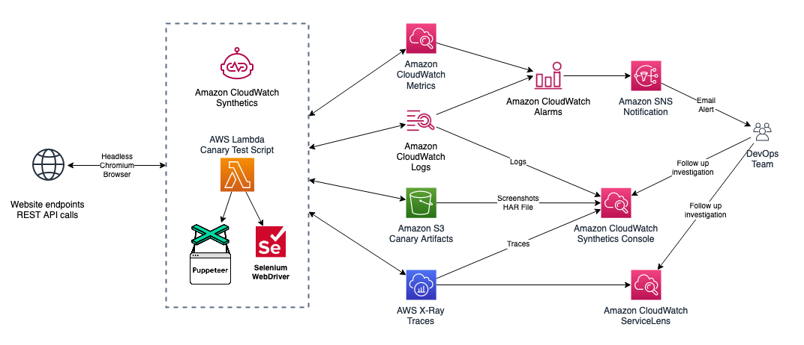
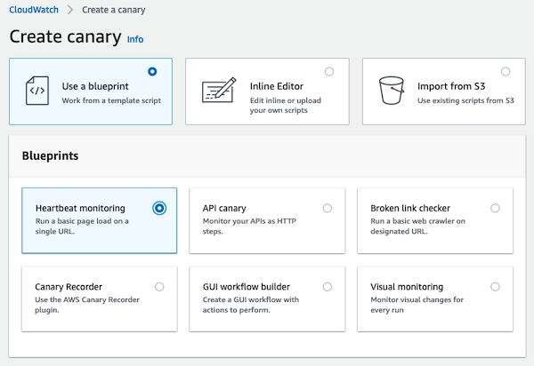

# Synthetic testing

Amazon CloudWatch Synthetics allows you to monitor applications from the perspective of your customer, even in the absence of actual users. By continuously testing your APIs and website experiences, you can gain visibility into intermittent issues that occur even when there is no user traffic.

Canaries are configurable scripts, that you can run on a schedule to continually test your APIs and website experiences 24x7. They follow the same code paths and network routes as real-users, and can notify you of unexpected behavior including latency, page load errors, broken or dead links, and broken user workflows.

!!! important
    Ensure that you use Synthetics canaries to monitor only endpoints and APIs where you have ownership or permissions. Depending on the canary frequency settings, these endpoints might experience increased traffic.

## Getting Started

### Full Coverage

!!! tip
    When developing your testing strategy, consider both public and [private internal endpoints](https://aws.amazon.com/blogs/mt/monitor-your-private-endpoints-using-cloudwatch-synthetics/) within your Amazon VPC.

### Recording New Canaries

The [CloudWatch Synthetics Recorder](https://chrome.google.com/webstore/detail/cloudwatch-synthetics-rec/bhdnlmmgiplmbcdmkkdfplenecpegfno) Chrome browser plugin allows you to quickly build new canary test scripts with complex workflows from scratch. The type and click actions taken during recording are converted into a Node.js script that you can use to create a canary. The known limitations of the CloudWatch Synthetics Recorder are noted on [this page](https://docs.aws.amazon.com/AmazonCloudWatch/latest/monitoring/CloudWatch_Synthetics_Canaries_Recorder.html#CloudWatch_Synthetics_Canaries_Recorder-limitations).

### Viewing Aggregate Metrics

Take advantage of the out-of-the-box reporting on aggregate metrics collected from your fleet of canary scripts. CloudWatch Automatic Dashboard

## Building Canaries

### Blueprints

Use [canary blueprints](https://docs.aws.amazon.com/AmazonCloudWatch/latest/monitoring/CloudWatch_Synthetics_Canaries_Blueprints.html) to simplify the setup process for multiple canary types.

!!! info
    Blueprints are a convenient way to start writing canaries and simple use cases can be covered with no code.

### Maintainability

When you write your own canaries, they are tied to a *runtime version*. This will be a specific version of either Python with Selenium, or JavaScript with Puppeteer. See [this page] for a list of our currently-supported runtime versions and those that are deprecated. 

!!! success
    Improve the maintainability of your scripts by [using environment variables](https://aws.amazon.com/blogs/mt/using-environment-variables-with-amazon-cloudwatch-synthetics/) to share data that can be accessed during the canary's execution.

!!! success
    Upgrade your canaries to the latest runtime version when available. 

### String Secrets

You can code your canaries to pull secrets (such as login credentials) from a secure system outside of your canary or its environment variables. Any system that can be reached by AWS Lambda can potentially provide secrets to your canaries at runtime.

!!! success
    Execute your tests and [secure sensitive data](https://aws.amazon.com/blogs/mt/secure-monitoring-of-user-workflow-experience-using-amazon-cloudwatch-synthetics-and-aws-secrets-manager/) by storing secrets like database connection details, API keys, and application credentials using AWS Secrets Manager.

## Managing Canaries at Scale

### Check for Broken Links

!!! success
    If your website contains a high-volume of dynamic content and links, you can use CloudWatch Synthetics to crawl your website, [detect broken links](https://aws.amazon.com/blogs/mt/cloudwatch-synthetics-to-find-broken-links-on-your-website/), and find the reason for failure. Then use a failure threshold to optionally create a CloudWatch Alarm when a failure threshold has been violated.

### Multiple Heartbeat URLs

!!! success
    Simplify your testing and optimize costs by [batching multiple URLs](https://aws.amazon.com/blogs/mt/simplify-your-canary-by-batching-multiple-urls-in-amazon-cloudwatch-synthetics/) in a single heartbeat monitoring canary test. You can then see the status, duration, associated screenshots, and failure reason for each URL in the step summary of the canary run report.

### Organize in Groups

!!! success
    Organize and track your canaries in [groups](https://docs.aws.amazon.com/AmazonCloudWatch/latest/monitoring/CloudWatch_Synthetics_Groups.html) to view aggregated metrics and more easily isolate and drill in to failures.

!!! warning
    Note that groups will require the *exact* name of the canary if you are creating a cross-region group.

## Runtime Options

### Versions and Support

CloudWatch Synthetics currently supports runtimes that use Node.js for scripts and the [Puppeteer](https://github.com/puppeteer/puppeteer) framework, and runtimes that use Python for scripting and [Selenium WebDriver](https://www.selenium.dev/documentation/webdriver/) for the framework.

!!! success
    Always use the most recent runtime version for your canaries, to be able to use the latest features and updates made to the Synthetics library.

CloudWatch Synthetics notifies you by email if you have canaries that use [runtimes that are scheduled to be deprecated](https://docs.aws.amazon.com/AmazonCloudWatch/latest/monitoring/CloudWatch_Synthetics_Canaries_Library.html#CloudWatch_Synthetics_Canaries_runtime_support) in the next 60 days.

### Code Samples

Get started with code samples for both [Node.js and Puppeteer](https://docs.aws.amazon.com/AmazonCloudWatch/latest/monitoring/CloudWatch_Synthetics_Canaries_Samples.html#CloudWatch_Synthetics_Canaries_Samples_nodejspup) and [Python and Selenium](https://docs.aws.amazon.com/AmazonCloudWatch/latest/monitoring/CloudWatch_Synthetics_Canaries_Samples.html#CloudWatch_Synthetics_Canaries_Samples_pythonsel).

### Import for Selenium

Create canaries in [Python and Selenium](https://aws.amazon.com/blogs/mt/create-canaries-in-python-and-selenium-using-amazon-cloudwatch-synthetics/) from scratch or by importing existing scripts with minimal changes.
