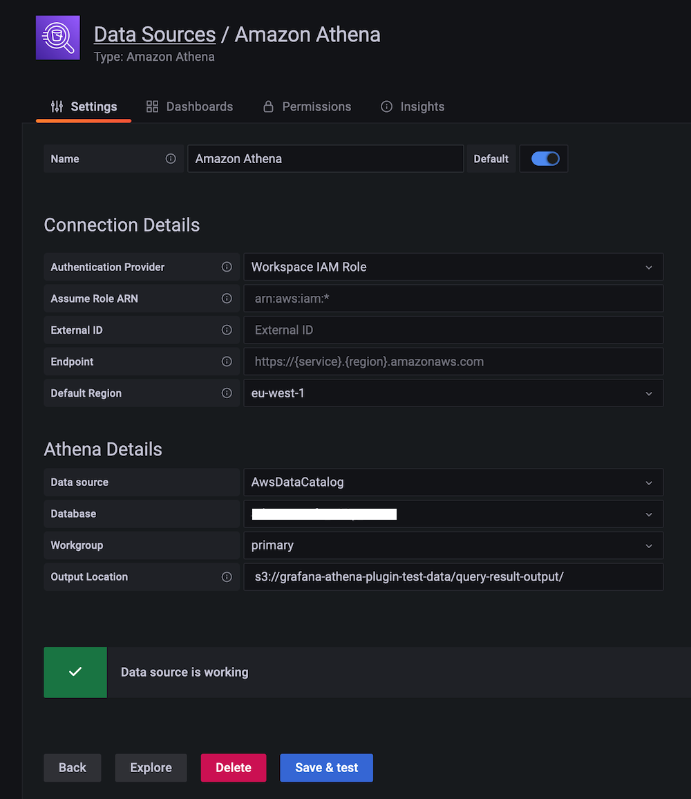
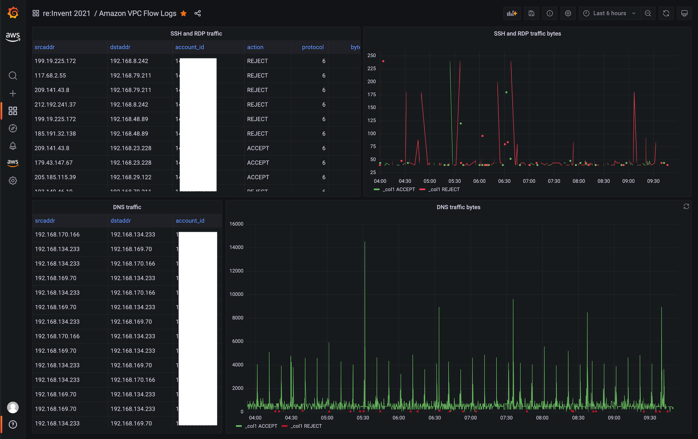

# Amazon Managed Grafana で Athena を使用する

このレシピでは、[Amazon Athena][athena] を [Amazon Managed Grafana][amg] で使用する方法を紹介します。Athena は、Amazon S3 のデータを標準 SQL を使用して分析できるサーバーレスの対話型クエリサービスです。この統合は、[Grafana 用 Athena データソース][athena-ds] によって実現されています。これはオープンソースのプラグインで、DIY Grafana インスタンスで使用できるだけでなく、Amazon Managed Grafana にもプリインストールされています。

!!! note
    このガイドの完了には約 20 分かかります。

## 前提条件

* [AWS CLI][aws-cli] がインストールされ、環境に [設定][aws-cli-conf] されていること。
* アカウントから Amazon Athena にアクセスできること。

## インフラストラクチャ

まず、必要なインフラストラクチャを設定しましょう。

### Amazon Athena の設定

Athena を 2 つの異なるシナリオで使用する方法を確認したいと考えています。1 つは Geomap プラグインとともに地理データを使用したシナリオで、もう 1 つは VPC フローログを使用したセキュリティ関連のシナリオです。

まず、Athena が設定され、データセットが読み込まれていることを確認しましょう。

!!! warning
    これらのクエリを実行するには、Amazon Athena コンソールを使用する必要があります。
    Grafana はデータソースへの読み取り専用アクセス権しかないため、データの作成や更新に使用できません。

#### 地理データの読み込み

この最初のユースケースでは、[Registry of Open Data on AWS][awsod] からのデータセットを使用します。
より具体的には、地理データをモチベーションとしたユースケースのために Athena プラグインの使用法を示すために、[OpenStreetMap][osm](OSM)を使用します。
そのためには、まず OSM データを Athena に取り込む必要があります。

そこで、まず Athena で新しいデータベースを作成します。[Athena コンソール][athena-console] に移動し、以下の 3 つの SQL クエリを使用して、OSM データをデータベースにインポートします。

クエリ 1:

```sql
CREATE EXTERNAL TABLE planet (
  id BIGINT,
  type STRING,
  tags MAP<STRING,STRING>,
  lat DECIMAL(9,7),
  lon DECIMAL(10,7),
  nds ARRAY<STRUCT<ref: BIGINT>>,
  members ARRAY<STRUCT<type: STRING, ref: BIGINT, role: STRING>>,
  changeset BIGINT,
  timestamp TIMESTAMP,
  uid BIGINT,
  user STRING,
  version BIGINT
)
STORED AS ORCFILE
LOCATION 's3://osm-pds/planet/';
```

クエリ 2: 

```sql
CREATE EXTERNAL TABLE planet_history (
    id BIGINT,
    type STRING,
    tags MAP<STRING,STRING>,
    lat DECIMAL(9,7),
    lon DECIMAL(10,7),
    nds ARRAY<STRUCT<ref: BIGINT>>,
    members ARRAY<STRUCT<type: STRING, ref: BIGINT, role: STRING>>,
    changeset BIGINT,
    timestamp TIMESTAMP,
    uid BIGINT,
    user STRING,
    version BIGINT,
    visible BOOLEAN
)
STORED AS ORCFILE
LOCATION 's3://osm-pds/planet-history/';
```

クエリ 3:

```sql
CREATE EXTERNAL TABLE changesets (
    id BIGINT,
    tags MAP<STRING,STRING>,
    created_at TIMESTAMP,
    open BOOLEAN,
    closed_at TIMESTAMP,
    comments_count BIGINT,
    min_lat DECIMAL(9,7),
    max_lat DECIMAL(9,7),
    min_lon DECIMAL(10,7),
    max_lon DECIMAL(10,7),
    num_changes BIGINT,
    uid BIGINT,
    user STRING
)
STORED AS ORCFILE
LOCATION 's3://osm-pds/changesets/';
```


#### VPC フローログデータの読み込み

2 つ目のユースケースは、セキュリティを目的としたものです。[VPC フローログ][vpcflowlogs] を使用してネットワークトラフィックを分析します。

まず、EC2 に VPC フローログを生成させる必要があります。
したがって、まだ行っていない場合は、ネットワークインターフェイスレベル、サブネットレベル、VPC レベルのいずれかで [VPC フローログを作成][createvpcfl] します。  

!!! note
    クエリパフォーマンスを向上させ、ストレージフットプリントを最小限に抑えるために、VPC フローログを列指向のストレージフォーマットである [Parquet][parquet] に格納します。Parquet はネストされたデータをサポートしています。

当社の設定では、Parquet 形式で S3 バケットに公開されている限り、オプション (ネットワークインターフェイス、サブネット、VPC) は関係ありません。
以下のように表示されます。


次に、[Athena コンソール][athena-console] から、OSM データをインポートしたのと同じデータベースで、VPC フローログデータのテーブルを作成するか、必要に応じて新しいデータベースを作成します。

次の SQL クエリを使用し、`VPC_FLOW_LOGS_LOCATION_IN_S3` を独自のバケット/フォルダに置き換えてください。


```sql
CREATE EXTERNAL TABLE vpclogs (
  `version` int, 
  `account_id` string, 
  `interface_id` string, 
  `srcaddr` string, 
  `dstaddr` string, 
  `srcport` int, 
  `dstport` int, 
  `protocol` bigint, 
  `packets` bigint, 
  `bytes` bigint, 
  `start` bigint, 
  `end` bigint, 
  `action` string, 
  `log_status` string, 
  `vpc_id` string, 
  `subnet_id` string, 
  `instance_id` string, 
  `tcp_flags` int, 
  `type` string, 
  `pkt_srcaddr` string, 
  `pkt_dstaddr` string, 
  `region` string, 
  `az_id` string, 
  `sublocation_type` string, 
  `sublocation_id` string, 
  `pkt_src_aws_service` string, 
  `pkt_dst_aws_service` string, 
  `flow_direction` string, 
  `traffic_path` int
)
STORED AS PARQUET
LOCATION 'VPC_FLOW_LOGS_LOCATION_IN_S3'
```

たとえば、S3 バケット `allmyflowlogs` を使用している場合、`VPC_FLOW_LOGS_LOCATION_IN_S3` は次のようになります。

```
s3://allmyflowlogs/AWSLogs/12345678901/vpcflowlogs/eu-west-1/2021/
```

これで Athena でデータセットが利用可能になったので、Grafana に進みましょう。

### Grafanaの設定

Grafanaインスタンスが必要なので、[Amazon Managed Grafanaワークスペース][amg-workspace]を新規作成するか、既存のものを使用します。 新規作成する場合は、[Getting Started][amg-getting-started]ガイドを参考にしてください。

!!! warning
    AWSデータソースの構成を使用するには、まずAmazon Managed Grafanaコンソールに移動し、Athenaリソースを読み取るために必要なIAMポリシーをワークスペースに付与する、サービスマネージドIAMロールを有効にしてください。
    さらに、次の点に注意してください。

	1. 使用する予定のAthenaワークグループは、キー`GrafanaDataSource`と値`true`というタグが付いている必要があります。これにより、サービスマネージドアクセス許可でそのワークグループを使用できるようになります。
	1. サービスマネージドIAMポリシーは、`grafana-athena-query-results-`で始まるクエリ結果バケットへのアクセスのみを許可するので、他のバケットを使用する場合はアクセス許可を手動で追加する必要があります。 
	1. クエリ対象の基礎となるデータソースへの`s3:Get*`および`s3:List*`アクセス許可を手動で追加する必要があります。


Athenaデータソースの設定では、左側のツールバーから下のAWSアイコンを選択し、「Athena」を選択します。プラグインがデータソース検出に使用するデフォルトリージョンを選択し、アカウントを選択した後、「Add data source」を選択します。

あるいは、次の手順でAthenaデータソースを手動で追加および構成できます。

1. 左側のツールバーの「Configurations」アイコンをクリックし、「Add data source」をクリックします。  
1. 「Athena」と入力します。
1. [オプション] 認証プロバイダーを構成します(推奨: ワークスペースIAMロール)。
1. 対象のAthenaデータソース、データベース、ワークグループを選択します。  
1. ワークグループに出力場所がまだ構成されていない場合は、クエリ結果に使用するS3バケットとフォルダを指定します。 サービスマネージドポリシーの恩恵を受けるには、バケット名が `grafana-athena-query-results-` で始まる必要があることに注意してください。
1. 「Save & test」をクリックします。  

次のような画面が表示されるはずです。



## 使い方

次に、Grafana から Athena データセットを使用する方法を見ていきましょう。

### 地理データを使用する

Athena の [OpenStreetMap][osm](OSM) データを使用すると、「ある施設がどこにあるか」など、さまざまな質問に答えることができます。その実際の使用例を見ていきましょう。

たとえば、ラスベガス地域の飲食店をリストするための OSM データセットに対する SQL クエリは次のとおりです。

```sql
SELECT 
tags['amenity'] AS amenity,
tags['name'] AS name,
tags['website'] AS website,
lat, lon
FROM planet
WHERE type = 'node'
  AND tags['amenity'] IN ('bar', 'pub', 'fast_food', 'restaurant')
  AND lon BETWEEN -115.5 AND -114.5
  AND lat BETWEEN 36.1 AND 36.3
LIMIT 500;
```

!!!info
    上記クエリのラスベガス地域は、緯度が `36.1` から `36.3` の間、経度が `-115.5` から `-114.5` の間と定義されています。
	これを各コーナーの変数セットに変換し、Geomap プラグインを他の地域に適応させることができます。

上記のクエリを使用して OSM データを可視化するには、[osm-sample-dashboard.json](./amg-athena-plugin/osm-sample-dashboard.json) からサンプルダッシュボードをインポートできます。そのダッシュボードは次のようになります。

  

!!!note
    上記のスクリーンショットでは、データポイントをプロットするために左パネルの Geomap 可視化を使用しています。

### VPC フローログデータの使用

VPC フローログデータを分析し、SSH と RDP トラフィックを検出するには、
次の SQL クエリを使用します。

SSH/RDP トラフィックの表形式の概要を取得:

```sql
SELECT
srcaddr, dstaddr, account_id, action, protocol, bytes, log_status
FROM vpclogs
WHERE
srcport in (22, 3389)
OR
dstport IN (22, 3389)
ORDER BY start ASC;
```

受け入れたバイト数と拒否したバイト数の時系列ビューを取得:


```sql
SELECT
from_unixtime(start), sum(bytes), action
FROM vpclogs
WHERE
srcport in (22,3389)
OR
dstport IN (22, 3389)
GROUP BY start, action
ORDER BY start ASC;
```

!!! tip
    Athena でクエリするデータ量を制限する場合は、
	`$__timeFilter` マクロを使用することを検討してください。

VPC フローログデータを視覚化するには、[vpcfl-sample-dashboard.json](./amg-athena-plugin/vpcfl-sample-dashboard.json) 
からサンプルダッシュボードをインポートできます。
ダッシュボードの表示は次のとおりです:



ここから、Amazon Managed Grafana で独自のダッシュボードを作成するために、
次のガイドを使用できます:

* [ユーザーガイド: ダッシュボード](https://docs.aws.amazon.com/grafana/latest/userguide/dashboard-overview.html)
* [ダッシュボード作成のベストプラクティス](https://grafana.com/docs/grafana/latest/best-practices/best-practices-for-creating-dashboards/)

以上で、Grafana から Athena を使用する方法を学習することができました。お疲れ様でした。

## クリーンアップ

使用していた Athena データベースから OSM データを削除し、コンソールから Amazon Managed Grafana ワークスペースを削除してください。

[athena]: https://aws.amazon.com/athena/
[amg]: https://aws.amazon.com/grafana/  
[athena-ds]: https://grafana.com/grafana/plugins/grafana-athena-datasource/
[aws-cli]: https://docs.aws.amazon.com/cli/latest/userguide/cli-chap-install.html
[aws-cli-conf]: https://docs.aws.amazon.com/cli/latest/userguide/cli-chap-configure.html
[amg-getting-started]: https://aws.amazon.com/blogs/mt/amazon-managed-grafana-getting-started/
[awsod]: https://registry.opendata.aws/
[osm]: https://aws.amazon.com/blogs/big-data/querying-openstreetmap-with-amazon-athena/
[vpcflowlogs]: https://docs.aws.amazon.com/vpc/latest/userguide/flow-logs.html
[createvpcfl]: https://docs.aws.amazon.com/vpc/latest/userguide/flow-logs-s3.html#flow-logs-s3-create-flow-log  
[athena-console]: https://console.aws.amazon.com/athena/
[amg-workspace]: https://console.aws.amazon.com/grafana/home#/workspaces
[parquet]: https://github.com/apache/parquet-format
